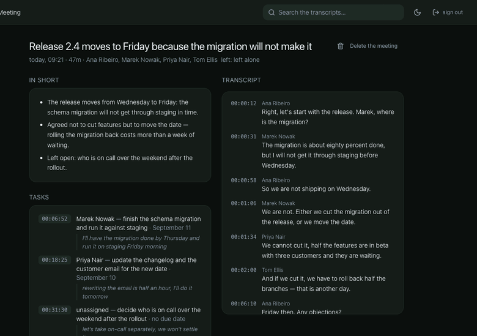
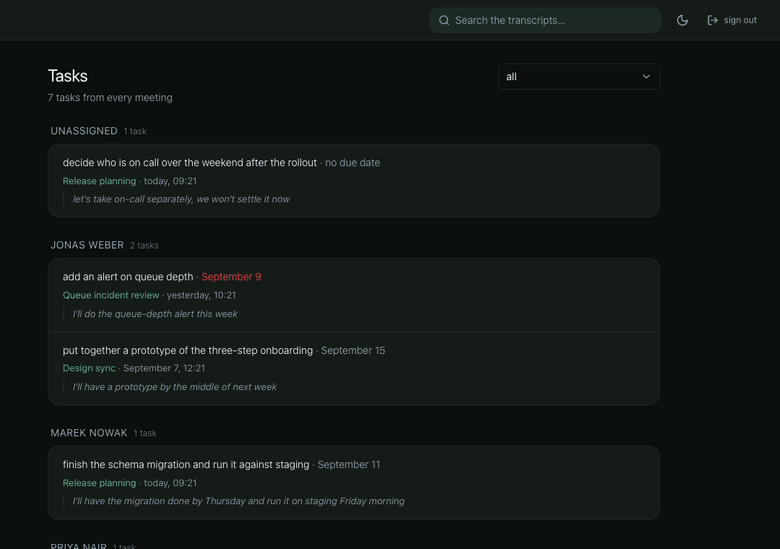
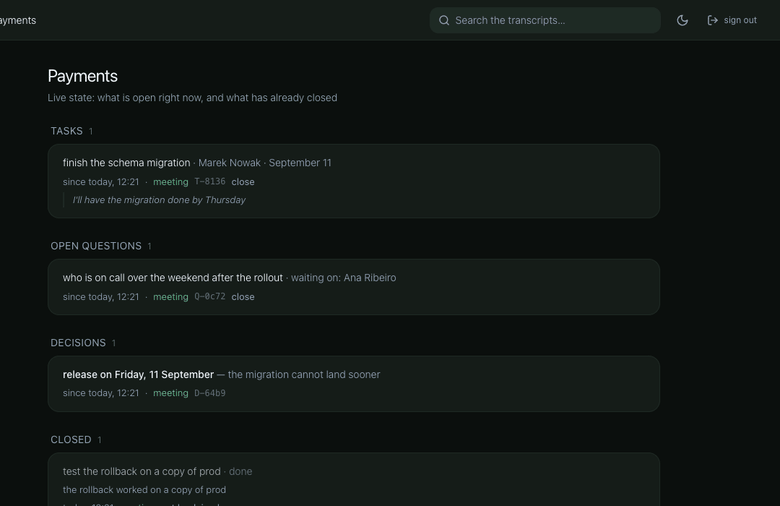
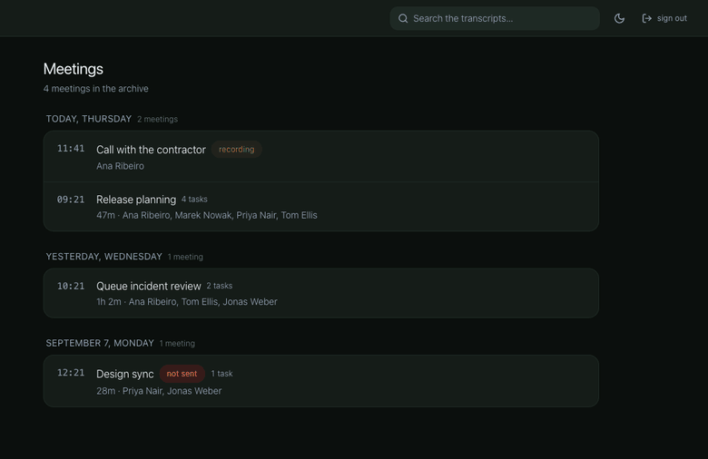

<div align="center">


# steno

**Your meetings, written up by a bot that already knows your codebase.**

[](https://github.com/sur1cat/steno/releases)
[](docs/install.md)
[](https://go.dev)
[](#how-the-bot-gets-into-a-call)
[](LICENSE)

**English** · [Русский](README.ru.md)

<p>
<a href="#install"></a>
&nbsp;
<a href="docs/commands.md"></a>
&nbsp;
<a href="#tour"></a>
&nbsp;
<a href="docs/cost.md"></a>
&nbsp;
<a href="https://github.com/sur1cat/steno/releases/latest"></a>
</p>

<picture>
  <source media="(prefers-color-scheme: dark)" srcset="assets/intro-dark.svg">
  
</picture>

</div>

A bot joins the call, records it, transcribes it and writes the follow-up —
decisions, tasks and open questions, filed under your projects and outliving the
meeting. A task can go on to a coding agent — as a spec written from your
repository, in a worktree of its own — and come back as a branch. One Go
binary; recordings stay on your machine.

<div align="center">
<picture>
  <source media="(prefers-color-scheme: dark)" srcset="assets/term-start-dark.svg">
  
</picture>
</div>

## Why this and not Otter, Fireflies or Fathom

Those are good. If a transcript with a summary is all you need, they do it
today with no server and no setup. steno is for three things they don't do,
and one they can't promise.

🧠 **It learns your vocabulary from your code.** Attach a repository and steno
reads its README, manifests, layout and the subjects of recent commits — that
last part matters most, because that is where the words your team says out loud
live. So *"fix the webhooks in billing"* files itself under the right project.

📌 **The project outlives the meeting.** Before each call the model is shown
what is still open, so the same task is not created again every week. Once a
day new commits are matched against open tasks: work done quietly, never
mentioned on a call, still gets closed — with the commit as evidence.

🛠 **A task can become a branch.** Pick one off the follow-up: steno writes the
spec from the repository — where the code lives, how to check it, what is still
missing — and, on your say-so, hands it to Claude Code or Codex in a worktree
of its own. What comes back is a branch to review. Never a push.

🔒 **The recording stays with you.** When the bot joins, it is a visible
participant with "recording" in its name, and anyone on the call can remove it.
Audio and transcripts live in one directory on your machine; with local whisper
and a local model, nothing leaves at all.

## Install

| | |
|---|---|
| macOS, Linux | `brew install sur1cat/tap/steno` |
| Debian, Ubuntu | `sudo apt install ./steno_<version>_amd64.deb` — the `.deb` is on [Releases](https://github.com/sur1cat/steno/releases/latest) |
| Fedora, RHEL | `sudo dnf install ./steno-<version>-1.x86_64.rpm` — the `.rpm`, same place |
| Any Linux or Mac | `curl -L https://github.com/sur1cat/steno/releases/latest/download/steno_<version>_<os>_<arch>.tar.gz \| tar xz` — `linux` or `darwin`, `amd64` or `arm64`; sums in [checksums.txt](https://github.com/sur1cat/steno/releases/latest/download/checksums.txt) |
| From source | `git clone https://github.com/sur1cat/steno && cd steno && make build` — Go and Node; not `go install`, [here is why](docs/install.md#from-source) |
| The bot | Docker must be running — the bot joins the call inside a container, pulled before the first call; `docker pull ghcr.io/sur1cat/steno-bot` does it now |

Then, whichever way you came in:

```console
steno setup     # nine questions, each answer checked
steno start     # background; steno stop ends it
```

<div align="center">
<picture>
  <source media="(prefers-color-scheme: dark)" srcset="assets/term-install-dark.svg">
  
</picture>
</div>

Secrets go into a `.env` with mode 0600, never into the config. `steno doctor`
says what is still missing and prints the line that fixes it.

**Each way with the full commands, the interface language, which model writes the follow-up —**
[docs/install.md](docs/install.md).

## Use it however suits you

**Where it runs** — one binary either way, and the panel is compiled into it, so
there is nothing to deploy but a file.

| | |
|---|---|
| 💻 **Your laptop** | your own meetings. Local whisper plus platform captions and nothing leaves the machine |
| 🖧 **One cheap VM** | the team's meetings. No GPU needed if transcription goes to Groq |

**How you look at it** — same database underneath; four of the five need no
service running.

| | | needs the service |
|---|---|---|
| ⌨️ **[CLI](docs/commands.md)** | `steno list`, `show`, `projects`, `cost`, `doctor` | no |
| 🖥️ **[`steno ui`](#tour)** | full-screen terminal: meetings, tasks, projects, search | no |
| 🌐 **[Panel](#tour)** | a browser, on the machine or over the network | yes |
| 🍎 **[Menu bar](#in-the-menu-bar)** | macOS: today, tasks, projects, one field to send the bot | only to send the bot |
| 🤖 **[MCP](#ask-the-assistant-you-already-use)** | Claude Code, Codex, Cursor, Claude Desktop — or a local model behind Goose or LM Studio | no |

**Who writes it up** — `steno setup` asks; `brain.provider` pins it. All four
hand back the same JSON, so nothing downstream knows who answered.

| | |
|---|---|
| 🅰️ **Claude** | an Anthropic key, or the Claude Code subscription through `claude -p` |
| 💬 **Codex** | the ChatGPT subscription through `codex exec` |
| 🔌 **The OpenAI dialect** | OpenAI, Groq, OpenRouter, Together, DeepSeek — or Ollama, LM Studio, llama.cpp, right here |
| 📜 **A script of your own** | `brain.provider = "command"`: one JSON object in, one out |

A model on your own machine costs nothing and sends nothing anywhere — with
local whisper, that is an install nothing leaves at all.

## How the bot gets into a call

<div align="center">
<picture>
  <source media="(prefers-color-scheme: dark)" srcset="assets/join-dark.svg">
  
</picture>
</div>

It joins under a name that says it is recording, so it is visible in the
participant list. Anyone can remove it — the follow-up is still produced from
what was captured.

| | |
|---|---|
| ✅ **Google Meet** | checked on real calls: joining, recording, captions for the speaker names |
| ✅ **A recording you already have** | Zoom, a phone call, a voice note — upload it, the rest is the same |
| 🚧 **Jitsi Meet** | built on Jitsi's own end-to-end tests; no bot has joined a live call yet |
| 🧭 **Teams · Zoom** | no bot — a CAPTCHA or a disabled setting you only discover on the call ([why](docs/how-it-works.md#what-works-and-what-does-not-yet)). Next instead: recording from your own laptop, microphone plus system audio, no bot at all |

## Bring your own

The model is not the only swappable part. Two more seams, both of them a
command and a page of contract. Neither needs a line of Go, a rebuild, or a
pull request.

**Transcription** takes an audio path and prints segments. Three adapters ship
in [`adapters/`](adapters); a fourth engine is ten lines of bash.

```json
"transcribe": { "cmd": ["./adapters/whisper-cpp.sh", "{{audio}}", "{{language}}"] }
```

**Publishing** takes the meeting on stdin and prints the link it published to.
Discord, Mattermost, Notion, a webhook, an email, a file in a folder, a ticket
in Jira — a short script each.

```json
"publish": { "targets": [ { "cmd": ["./adapters/discord.sh"] } ] }
```

What arrives on stdin — the raw analysis *and* the same follow-up already
written up, because an adapter that files tickets needs the fields and an
adapter that posts to a chat needs the text:

```json
{
  "meeting":    {"id": "…", "title": "…", "url": "…", "started_at": "…",
                 "duration_sec": 2520, "participants": ["…"], "projects": ["…"]},
  "followup":   {"title": "…", "tldr": ["…"], "action_items": [], "decisions": [],
                 "open_questions": [], "risks": [], "timeline": []},
  "text":       {"markdown": "…", "plain": "…", "html": "…"},
  "links":      {"google_doc": "…"},
  "transcript": "[00:01:12] Rustem: …"
}
```

Exit 0 means published, anything else means it was not, and stderr says why —
it goes into the log and is kept next to the meeting. stdout is the link, if
there is one.

[`adapters/discord.sh`](adapters/discord.sh) is the one to copy from: a Discord
webhook needs no app and no token, just a URL.

## A meeting from anywhere

Anything that can send a POST can send the bot into a call — a phone shortcut,
a Slack slash command, another team's admin panel, cron:

```console
$ curl -X POST http://steno:8787/join \
       -H "Authorization: Bearer $STENO_HTTP_TOKEN" \
       -d '{"url":"https://meet.google.com/abc-defg-hij"}'
{"text":"On my way to https://meet.google.com/abc-defg-hij …","meeting_id":"20260908-1530-abc"}
```

The shared secret is not optional — whoever knows it can send the bot into any
call, so the endpoint does not come up without one. It lives in the `.env`, and
never in the panel or the config. A refusal names which of the three things is
wrong: the header, the secret, or the link.

## Ask the assistant you already use

`steno mcp` is an MCP server over the same database, so the assistant that
knows your code now also knows what the team decided — with the second it was
said. No service has to be running.

<div align="center">
<picture>
  <source media="(prefers-color-scheme: dark)" srcset="assets/term-mcp-dark.svg">
  
</picture>
</div>

It is a protocol, not a vendor: any MCP client plugs in.

```console
claude mcp add steno -- steno mcp     # Claude Code
codex  mcp add steno -- steno mcp     # Codex CLI
```

Cursor, Claude Desktop, Zed and the rest take the same thing as JSON —
`{"mcpServers": {"steno": {"command": "steno", "args": ["mcp"]}}}`. A local
model works too: Ollama serves the model, and a client in front of it — Goose,
LM Studio, oterm — talks to steno. Seven tools, one of which writes:
[docs/commands.md](docs/commands.md#ask-a-model).

## Where it goes

The follow-up is sent; the tasks in it are kept.

| | |
|---|---|
| 📄 **Google Docs** | a document per meeting — and one per project, rewritten in place, so one link always shows the current state |
| 💬 **Slack** | the follow-up in the channel, plus a DM to whoever owns a task, matched by name |
| ✈️ **Telegram** | the team chat — and a reply in the chat the bot was asked from |
| 📜 **Your adapter** | Discord, Mattermost, Notion, Jira, a webhook, an email — [a short script each](#bring-your-own) |

Tasks, decisions and open questions stay per project — in the panel, `steno ui`
and the menu bar — until something closes them: the next call, a button, or a
commit. Once a day new commits are matched against open tasks, so work done
quietly is closed with the commit as evidence.

## A task becomes a branch

A task off a call is one sentence; the other nine tenths live in the code.
`steno spec` reads the repository behind the project and writes the spec: what
is known, where it lives in the code, what to do, how to check it — and, in a
section it refuses to leave out, what is still missing. A task that is not
code — *"ask Vika about the mockup"* — is declined with a reason, not padded
out into a document nobody asked for.

<div align="center">
<picture>
  <source media="(prefers-color-scheme: dark)" srcset="assets/term-spec-dark.svg">
  
</picture>
</div>

`steno spec run` hands it to Claude Code or Codex — the one behind your
follow-ups, or `agent.provider` to choose — in a git worktree of its own, on a
branch of its own. What comes back is a branch to look at. Never a push, never
a commit on main.

Off by default: `"agent": {"enabled": true}` in `steno.json` is the moment you
give steno the right to write files and run commands on this machine. And it
runs only on a human action — never from Telegram, mail or the HTTP endpoint:
anyone on a call can say *"delete the repository"*, and it would arrive as a
task.

## Tour

Everything below on demo data, before the first meeting and without a single
question asked: `steno demo` opens the panel in your browser — four meetings,
their tasks and decisions, a schedule for the next two days. Ctrl+C, and it
is gone.

<table>
<tr>
<td width="58%" align="center"></td>
<td width="42%" valign="middle">

### 📝 Click the timecode

Every task, decision and question carries the second it was said. Click it and
the transcript jumps there.

</td>
</tr>
<tr>
<td width="42%" valign="middle">

### ✅ Tasks, not meetings

One list across every call. Filter by owner and the whole thing regroups.

</td>
<td width="58%" align="center"></td>
</tr>
<tr>
<td width="58%" align="center"></td>
<td width="42%" valign="middle">

### 📌 A project remembers

Open items pile up per project until something closes them — the next call, a
button, or a commit.

</td>
</tr>
<tr>
<td width="42%" valign="middle">

### 🔎 Everything ever said

One box over transcripts and follow-ups. A hit opens the meeting at that second.

</td>
<td width="58%" align="center"></td>
</tr>
<tr>
<td width="58%" align="center"></td>
<td width="42%" valign="middle">

### 🖥️ The whole product, in a terminal

`steno ui`. No service, no browser: the same database. `?` lists the keys.

</td>
</tr>
<tr>
<td width="42%" valign="middle">

### 🗓️ Where it will go, before it goes

Built from the team's calendars: what it joins, what it skips, and why.

</td>
<td width="58%" align="center"></td>
</tr>
<tr>
<td width="58%" align="center"></td>
<td width="42%" valign="middle">

### 🔌 Channels explain themselves

Four ways in, four ways out. No tokens in this screen and there never will be.

</td>
</tr>
</table>

## Docs

| | |
|---|---|
| **[Commands](docs/commands.md)** | every command and flag, with what the output looks like |
| **[Install](docs/install.md)** | Linux, source builds, language, which model writes it up, the menu bar app |
| **[What it costs](docs/cost.md)** | transcription prices, which whisper model, scale |
| **[How it works](docs/how-it-works.md)** | the pipeline, getting the bot in, consent, what works and what does not |
| **[DESIGN.md](DESIGN.md)** | every design decision and why it is what it is |

## License

MIT
