<div align="center">

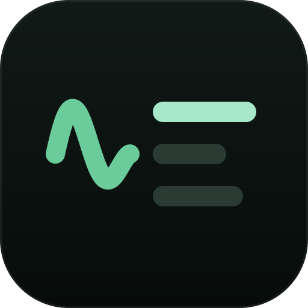

# steno

**Your meetings, written up by a bot that already knows your codebase.**

[](https://github.com/sur1cat/steno/releases)
[](#install)
[](https://go.dev)
[](LICENSE)

**English** · [Русский](README.ru.md)

[](#install)
[](#commands)
[](#tour)
[](#what-it-costs)
[](https://github.com/sur1cat/steno/releases/latest)

<picture>
  <source media="(prefers-color-scheme: dark)" srcset="assets/pipeline-flow-dark.svg">
  
</picture>

</div>

A bot joins the call, records it, transcribes it and writes the follow-up —
decisions, tasks and open questions, filed under your projects and outliving the
meeting. One Go binary; the panel is compiled into it. Recordings stay on your
machine.

<div align="center">
<picture>
  <source media="(prefers-color-scheme: dark)" srcset="assets/term-start-dark.svg">
  
</picture>
</div>

> Everything lives in one directory on your machine. Two things can leave it,
> both optional: the audio if you pick Groq, the transcript when Claude writes
> the follow-up. Local whisper plus platform captions — nothing leaves at all.

## Install

Docker must be running: the bot joins the call inside a container.

```console
brew install sur1cat/tap/steno
steno setup     # nine questions, each answer checked
steno start     # background; steno stop ends it
```

<div align="center">
<picture>
  <source media="(prefers-color-scheme: dark)" srcset="assets/term-install-dark.svg">
  
</picture>
</div>

`setup` makes its own directory (`~/steno`), writes the config there and puts
secrets in a `.env` with mode 0600 — never in the config, because the config is
meant to live in a repository. Then `steno doctor` says what is still missing and
prints the line that fixes it.

<details>
<summary><b>Linux, or building from source</b></summary>

<br>

Go and Node both needed — the panel is compiled into the binary:

```console
git clone https://github.com/sur1cat/steno && cd steno
make build && ./steno setup
```

`go install` is deliberately not offered: the panel bundle is a build artifact
and is not kept in the repository, so a binary made that way comes up with no
panel at all — a working install by every appearance, until you open it.

The bot's container (Chromium under a virtual display, PulseAudio, ffmpeg) is
pulled before the first call. Ahead of time: `docker pull ghcr.io/sur1cat/steno-bot`.
Build it yourself: `make bot-image`.

</details>

<details>
<summary><b>Interface language</b></summary>

<br>

English by default; Russian is a full second language, not a subset. `steno setup`
asks first thing and writes the answer:

```json
{ "lang": "ru" }
```

For one command, without touching the config: `STENO_LANG=ru steno ui`.

The choice carries further than the labels — it sets the follow-up language
(`claude.output_language`), the language Meet is asked to recognise
(`bot.caption_language`), the name the bot appears under in the participant
list, and the calendar's skip markers.

</details>

<details>
<summary><b>Two ways to pay for Claude</b></summary>

<br>

**A subscription you already have.** steno calls `claude -p`, the
non-interactive mode of Claude Code. No API key, no second bill.

```console
claude auth login
steno setup       # pick "A Claude subscription"
```

**An API key.** Needed on a server — not for billing, but because `claude -p`
requires a login performed by a human, and nobody logs into a server.

```console
export ANTHROPIC_API_KEY=sk-ant-...
```

`steno doctor` says which one it found; `claude.via` pins it (`cli`, `api`,
`auto`). The subscription path costs a few more tokens — Claude Code sends its
own system prompt every call — but it comes out of a plan rather than a card.

</details>

<details>
<summary><b>Try it without setting anything up</b></summary>

<br>

```console
steno join --no-followup --captions https://meet.google.com/abc-defg-hij
```

The bot knocks as a guest, you let it in, talk for a minute, it prints the
transcript. No keys, no whisper, no bot account.

</details>

## Commands

Every command reads the same database the panel does, so almost none of them
needs the service running. Tap a group to open it.

<details open>
<summary><b>Run it</b></summary>

| | |
|---|---|
| `steno setup` | set it all up: one question at a time, each answer checked |
| `steno start` | run in the background — listen to the sources, go to meetings |
| `steno stop` | stop it, letting recordings in flight finish |
| `steno serve` | the same as `start`, without letting go of the terminal |
| `steno status` | is it running, since when, where the log is |
| `steno autostart on\|off` | start it when you log in |
| `steno doctor` | check every piece and print the fix under each problem |
| `steno version` | the version, and the bot image that matches it |

</details>

<details>
<summary><b>Record a meeting</b></summary>

| | |
|---|---|
| `steno join <meet-url>` | join, record, transcribe, send the follow-up |
| &nbsp;&nbsp;`--record-only` | record only |
| &nbsp;&nbsp;`--no-followup` | record and transcribe, no Claude |
| &nbsp;&nbsp;`--captions` | text from the platform's captions instead of whisper |
| `steno note` | dictate into the microphone — Enter stops it, then the same pipeline |
| &nbsp;&nbsp;`--devices` · `--device N` | list the microphones · pick one |
| &nbsp;&nbsp;`--title "…"` · `--max 30m` | name it yourself · recording ceiling |
| `steno process [id]` | transcribe a recorded meeting and send it out — no id, the last one |
| `steno publish [id]` | send a finished follow-up again |

</details>

<details>
<summary><b>Read what came out</b></summary>

| | |
|---|---|
| `steno ui` | the whole product, full screen in the terminal |
| `steno list` | recent meetings with the status each got stuck at |
| `steno show [id]` | the follow-up as text, with timecodes and where it went |
| `steno transcript [id]` | the transcript itself |
| `steno projects [name]` | what is open per project |
| `steno cost [days]` | measured tokens and what they cost |

</details>

<details>
<summary><b>Projects — how it learns your vocabulary</b></summary>

| | |
|---|---|
| `steno projects add <name>` | add a project; with no flags it asks |
| &nbsp;&nbsp;`--repo <url>` | repository (may be repeated) |
| &nbsp;&nbsp;`--path <dir>` | directory with the code on this machine |
| &nbsp;&nbsp;`--url <addr>` | site or document |
| &nbsp;&nbsp;`--about "…"` | one line saying what this project is |
| &nbsp;&nbsp;`--alias a,b` | what it is called out loud |
| &nbsp;&nbsp;`--people a,b` | people's names as they are said out loud |
| &nbsp;&nbsp;`--word a,b` | the project's services and abbreviations |
| `steno projects rm <name>` | remove it from the registry; its tasks stay |
| `steno context [name]` | build the primers from the code and the sites |

</details>

<details>
<summary><b>Clean up</b></summary>

| | |
|---|---|
| `steno rm <id>` | forget a meeting whole — recording, transcript, follow-up. Asks first |
| &nbsp;&nbsp;`--yes` | do not ask, for scripts |
| `steno prune` | delete old recordings by the retention in the config |

</details>

`-c <path>` points at another `steno.json`; `steno help` prints all of it at once.

## Four ways to use it

One database, four front doors. Three of the four work with the service stopped.

| | | needs the service |
|---|---|---|
| ⌨️ **[The CLI](#commands)** | everything the panel does has a command | no |
| 🖥️ **[`steno ui`](#tour)** | full-screen terminal: meetings, tasks, projects, search, channels | no |
| 🌐 **[The panel](#tour)** | `http://127.0.0.1:8422` in a browser | yes |
| 🍎 **[The menu bar](#in-the-menu-bar)** | macOS: today, tasks, projects, one field to send the bot | only to send the bot |

## Tour

<div align="center">
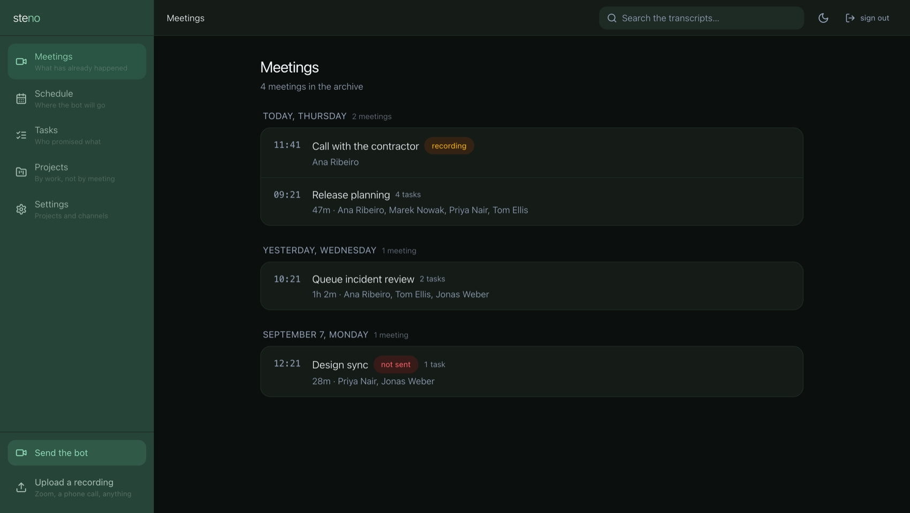
</div>

Everything the bot has been to, grouped by day: how long it ran, who was there,
how many tasks came out. One still recording says so; one whose follow-up never
went out says that too.

<table>
<tr>
<td width="55%" align="center">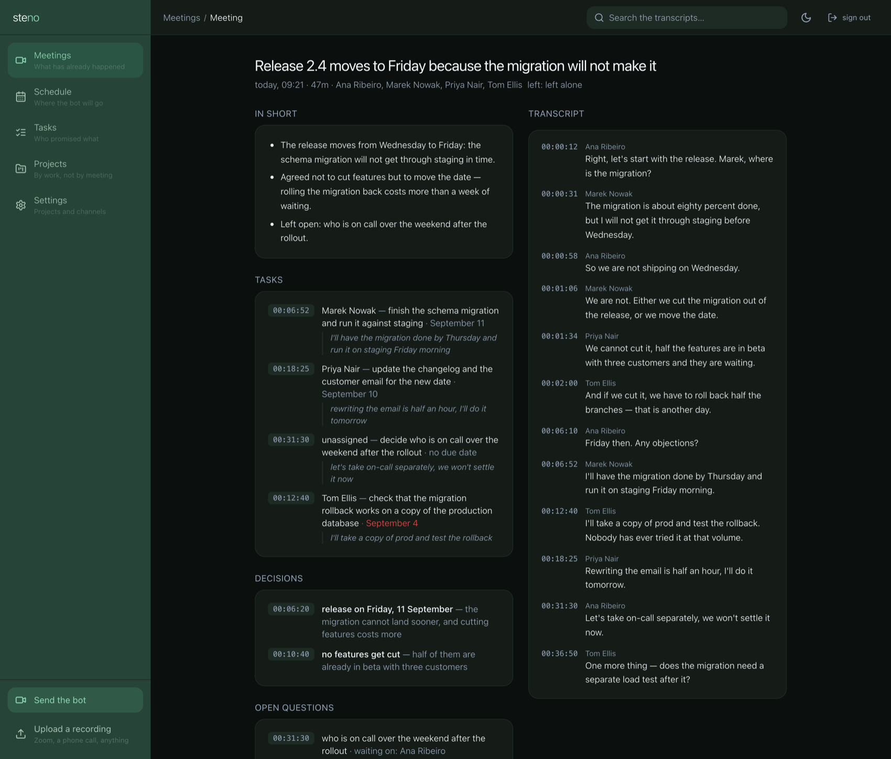</td>
<td width="45%" valign="middle">

### 📝 Next to the words it came from

Every task, decision and question carries the timecode and the quote. Click the
timecode and the transcript scrolls to that second. *"Who actually said that?"* —
one click instead of an argument.

</td>
</tr>
<tr>
<td width="45%" valign="middle">

### ✅ Tasks, not meetings

One list across every call, grouped by owner, overdue in red, the quote
underneath. Nobody reads seven follow-ups to find out what they owe.

</td>
<td width="55%" align="center">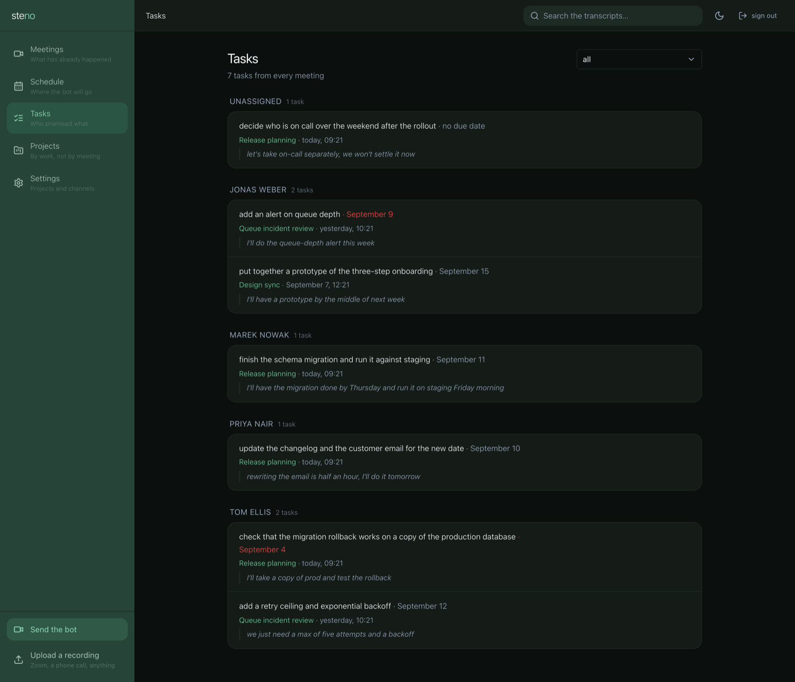</td>
</tr>
<tr>
<td width="55%" align="center">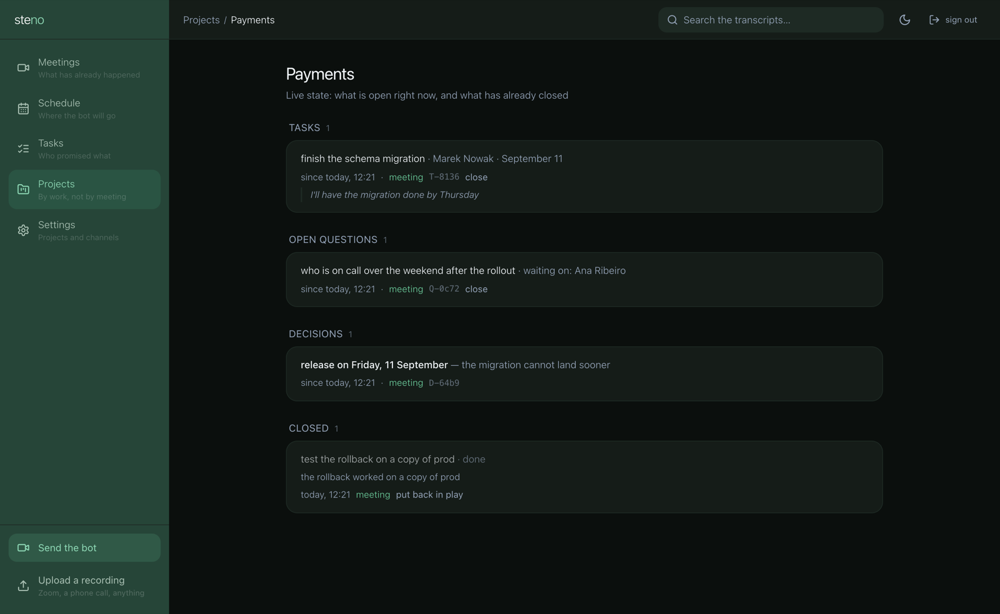</td>
<td width="45%" valign="middle">

### 📌 A project remembers

Tasks, questions and decisions pile up per project until something closes them —
the next call, a button, or a commit. Closed items keep the reason, because
*why* it was dropped is the part people forget.

</td>
</tr>
<tr>
<td width="45%" valign="middle">

### 🖥️ The whole product, in a terminal

`steno ui` — meetings, follow-ups, filters, projects, search, channel settings.
No service, no browser: the same database. `?` lists the keys, `q` quits.

</td>
<td width="55%" align="center">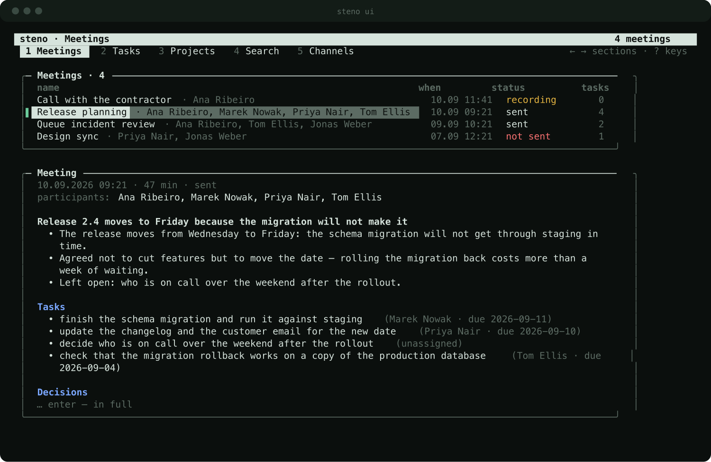</td>
</tr>
<tr>
<td width="55%" align="center">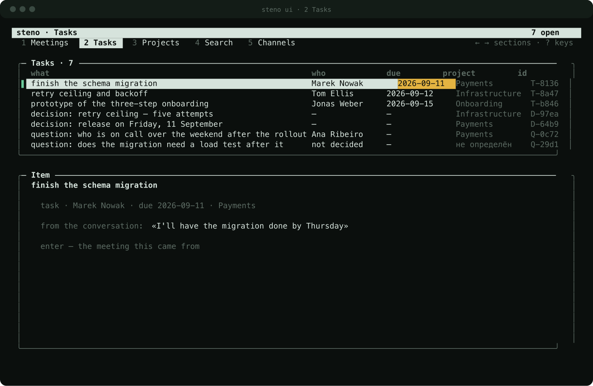</td>
<td width="45%" valign="middle">

### ⌨️ …including what you would expect to need a mouse for

Filter by project, owner, kind. Close one, drop one, reopen one. Create a
project and attach its repository.

</td>
</tr>
<tr>
<td width="45%" valign="middle">

### 🗓️ Where the bot will go, before it goes

Built from the team's calendars every fifteen minutes: which meetings it joins,
which it skips, and why. Change your mind here — not by dragging it out of a
call in front of everyone.

</td>
<td width="55%" align="center">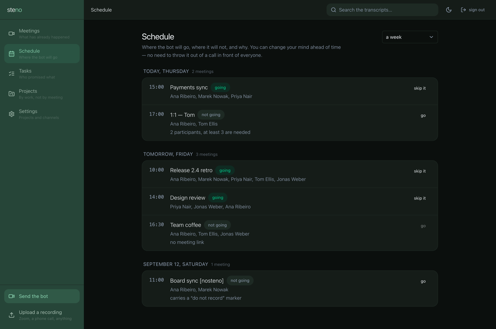</td>
</tr>
<tr>
<td width="55%" align="center">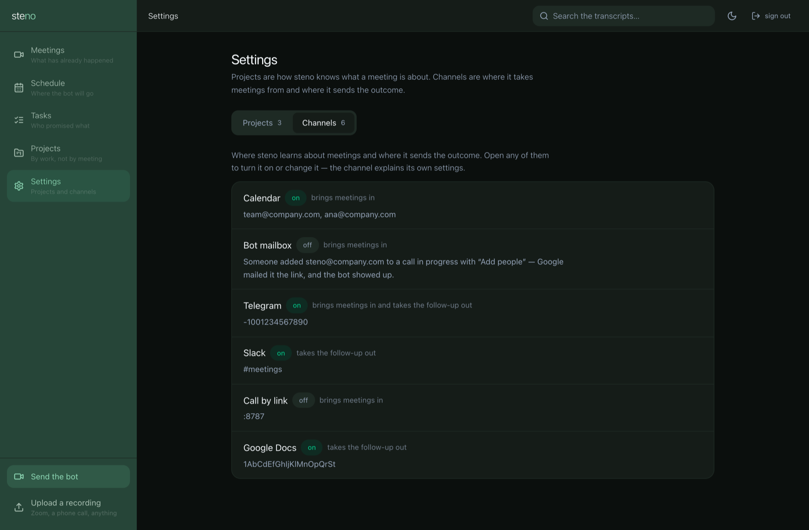</td>
<td width="45%" valign="middle">

### 🔌 Channels explain themselves

Four ways in, four ways out, each a card that says what it does before you turn
it on. No tokens in this screen and there never will be — `steno setup` puts
them in `.env`.

</td>
</tr>
<tr>
<td width="45%" valign="middle">

### 🔎 Everything ever said

One box over transcripts and follow-ups, matching on the start of a word. A hit
in a transcript opens the meeting at that second.

</td>
<td width="55%" align="center">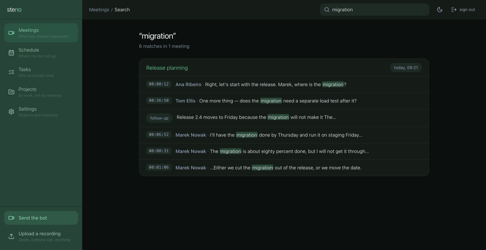</td>
</tr>
</table>

<div align="center">

*Light theme included, following the system unless you say otherwise.*

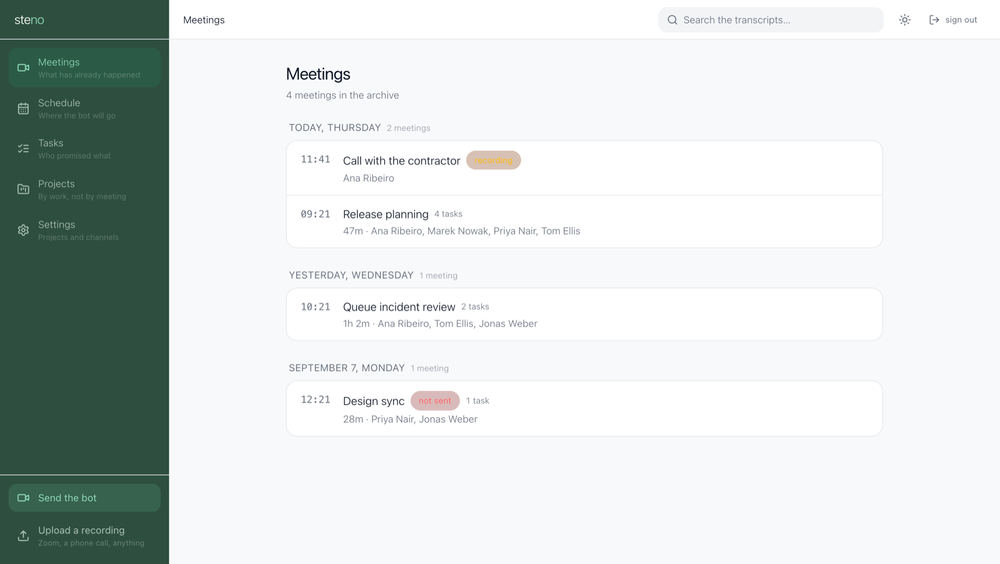

</div>

## In the terminal

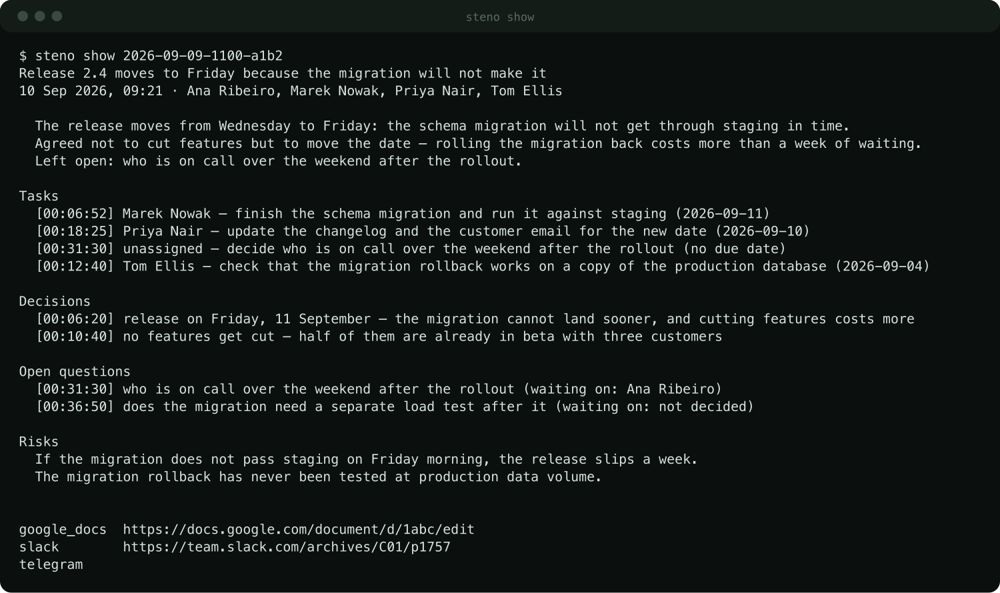

`steno show` — summary, tasks with owners and dates, decisions with reasons,
questions with who they wait on, risks. Each carries the second it was said; the
footer says where it went.

<details>
<summary><b>The rest of it, in pictures</b></summary>

<br>

`steno list` — the archive, newest first.

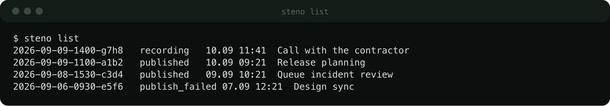

`steno projects` — the state that outlives the meeting. Short ids, so the CLI
and the panel talk about the same thing.

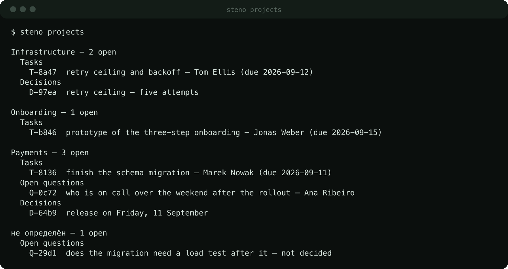

`steno cost 30` — measured tokens, not an estimate.

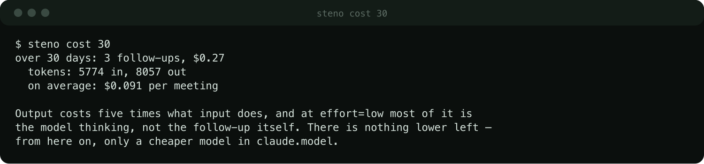

`steno doctor` — the command to run when something does not work.

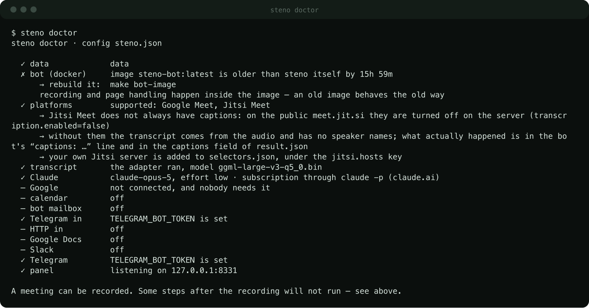

</details>

## In the menu bar

macOS only, built separately: an app for one person's Mac, not part of the
service. `brew install steno` does not touch it, and a server never sees it.

<!--BARIMG-->

It reads the database directly, so it answers even when the service is down. It
goes to the service for one thing — sending the bot to a call — and says plainly
when it cannot. ⌘N records a voice note through the same pipeline as a meeting.

```console
cd bar && ./build.sh && open build/StenoBar.app
```

## Why this and not Otter, Fireflies or Fathom

Those are good. If all you need is a transcript with a summary, they do it today
with no server and no setup. steno exists for two things they don't do.

🧠 **Your code teaches it your vocabulary.** Attach a repository and steno reads
its README, manifests, layout and the subjects of recent commits — that last
part matters most, because that is where the words your team says out loud live.
So *"fix the webhooks in billing"* files itself under the right project.

📌 **Project state outlives the meeting.** Before each call the model is shown
what is still open, so the same task is not created again every week. Once a day
new commits are matched against open tasks: work done quietly, never mentioned
on a call, still gets closed — with the commit as evidence.

## Getting the bot into a call

| | what a person does |
|---|---|
| 📅 **Calendar** | nothing — it reads the team's calendars and shows up a minute early |
| 📨 **Mail** | adds `steno@company.com` to a running call with "Add people" |
| 💬 **Telegram** | drops the link into a chat |
| 🔘 **Panel / HTTP** | a button, a Slack slash command, or `curl` |

The mail route: the bot has its own Google account anyway, so it can be invited
like a colleague and the inviter needs to know nothing about steno. Invitations
are accepted only from your own domain — otherwise the bot's address would be a
way to record someone else's conversation on your account.

Already have a recording, from Zoom or a phone call? **Upload a recording** in
the panel runs it through the same pipeline. Speaker names will be missing: they
come from the platform's captions, and someone else's file has none.

## What it costs

**Transcription.** Groq runs the same `whisper-large-v3` for $0.04 per hour of
audio — about **$6/month** for a team with 160 meeting-hours. A GPU VM for the
same work runs into the thousands and idles 97% of the time.

| 160 meeting-hours/month | |
|---|---|
| **Groq** (whisper-large-v3) | **$6** |
| AssemblyAI | $24 |
| Deepgram Nova-3 | $42 |
| OpenAI GPT-4o Transcribe | $58 |
| whisper on your hardware | free, needs a GPU or patience |
| platform captions | free, lower quality |

**The follow-up.** Default `claude-opus-5` at `effort: low` — about **$0.40**
for an hour-long meeting, $0.12 for a short one. `setup` also offers
`claude-sonnet-5`: two and a half times cheaper, usually enough for a standup.

<details>
<summary><b>Why effort stays low — measured, not guessed</b></summary>

<br>

One marked-up meeting, ten combinations of model and effort: all ten pulled the
same five assignments with the right owners and the right dates. Effort added no
task — only time and money, up to 23 minutes and $1.39 against 40 seconds and
$0.12 on the same text. Raise it for sharper wording in the risks, not for
fuller lists. `steno cost` reports measured tokens, not estimates.

</details>

## Transcription: pick a model

| | quality | speed | privacy |
|---|---|---|---|
| **Groq** | whisper-large-v3 | an hour of audio in ~10s | audio leaves your network |
| **whisper locally** | `large-v3-q5_0`, 1 GB | ~13 min per meeting-hour on Apple Silicon; **3 hours** on CPU | nothing leaves |
| **platform captions** | noticeably worse, one language | instant | nothing leaves |

⚠️ **Take `large-v3-q5_0`, skip `turbo`.** Quantizing large-v3 costs nothing —
the transcripts match word for word at a third of the disk. `turbo` is the trap:
twice as fast, and it rewrote a product name it did not know (`Plaud`) into one
it did (`Cloud AI`), then looped `Cloud` seventeen times over the most
substantive minute of the call. A follow-up written from that will confidently
describe an integration nobody mentioned.

Meet recognises **one** language per session, so a call that switches languages
needs whisper. Captions are used either way — they are the only source of
speaker names.

## Consent

The bot joins under a name that says it is recording, visible in the participant
list. Anyone can remove it: the recording closes cleanly and the follow-up is
still produced from what was captured. Put a line about recording in the
invitation — some jurisdictions require consent from every party, not just the
organiser.

## What works, and what does not yet

✅ **Works, checked on real calls.** Google Meet: joining and recording.
Transcription with whisper locally or through Groq. The follow-up with tasks,
decisions, questions and risks. Per-project attribution. Project primers built
from a repository. Voice notes. Telegram in and out. The panel. `steno ui`.
Background mode with autostart. The menu bar app.

⚠️ **Works, with a caveat.** Speaker names come from the platform's captions. If
Meet is set to a different language than people speak, it produces almost no
captions and names get thin; steno falls back to the active-speaker tile and
says in the log how much it caught. Setting the caption language cannot be
automated — Google removed the control and does not document the current one.
Set it once by hand in the bot's account (⋮ → Settings → Captions).

🚧 **Built, not yet run against the real thing.** Jitsi Meet — the DOM handling
comes from Jitsi's own end-to-end tests, but no bot has joined a live call yet.
Calendar, bot mailbox and Slack sources. Google Docs publishing. Daily
commit-to-task matching.

🚫 **Deliberately not built.** Microsoft Teams: meeting policy can put a CAPTCHA
in front of anonymous participants, and you cannot tell in advance whether it is
on. Zoom: joining by link depends on a setting many organisations disable. A
platform that is claimed but does not work is worse than one that is missing —
you find out on the call.

## How it works

1. 📅 The bot shows up — calendar, mail, Telegram, or a button.
2. 🎙️ It records: Chromium under a virtual display in a container. Audio to
   `.ogg`, the platform's captions to `.jsonl`.
3. ✍️ Two sources become one transcript. Text from whisper because it is
   accurate; names from the platform because they are authoritative. Stitched by
   time.
4. 🧩 Claude writes the follow-up, each item carrying the quote and the second it
   came from.
5. 📬 It lands in Telegram, Slack, Google Docs, the panel — and stays, per
   project, until it is closed.

Every design decision and why it is what it is: [DESIGN.md](DESIGN.md).

## License

MIT
