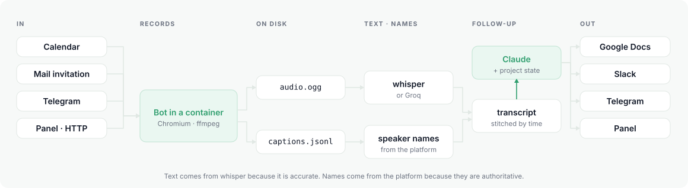

<div align="center">


# steno

**Your meetings, written up by a bot that already knows your codebase.**

[](https://github.com/sur1cat/steno/releases)
[](#install)
[](#install)
[](https://go.dev)
[](LICENSE)

**English** · [Русский](README.ru.md)


</div>

A bot joins your calls, records them, transcribes them, and writes a follow-up:
decisions, action items and open questions, attributed to your projects and
outliving the individual meeting. Recordings and transcripts stay on your
machine. One Go binary — the panel is compiled into it, so there is nothing to
deploy but a file.

```console
$ steno start
12:04:11 telegram: listening for meeting links (1 allowed chats)
12:04:11 panel: listening on 127.0.0.1:8422

12:59:03 on the way to “Release planning” (meet.google.com/abc-defg-hij, reason: calendar)
12:59:14 in the call
12:59:14 recording the audio to data/recordings/2026-09-09-1300-a1b2/audio.ogg
13:46:26 recording finished: 47m12s, 12.4 MB, 4 participants
13:46:26 captions: 412 lines, 39812 letters in 47m12s (843 letters per minute)
13:46:27 transcribing data/recordings/2026-09-09-1300-a1b2/audio.ogg
13:52:40 names: 397 from captions, 12 from the active-speaker highlight, 3 without a name
13:52:41 writing the follow-up (claude-opus-5, access: subscription through claude -p)
13:53:22 tasks: 4, decisions: 2, open questions: 2
13:53:22 spend: 2.1k in, 3.7k out, cache 12k/10k — $0.12
13:53:23 telegram: sent
```

Everything above happens without you. Or ask for it by hand:

```console
steno join https://meet.google.com/abc-defg-hij   # one call, right now
steno ui                                          # everything, in the terminal
```

> Audio, transcripts and the database live in one directory on your machine.
> Only two things ever leave it, and both are optional: the audio, if you pick
> Groq for transcription, and the transcript, when Claude writes the follow-up.
> Pick local whisper and platform captions and nothing leaves at all.

## Why this and not Otter, Fireflies or Fathom

Those are good, and if all you need is a transcript with a summary, they will do
it today with no server and no setup. Fathom has a generous free tier; Fireflies
runs about $10 per person per month.

steno exists for two things they don't do.

🧠 **Your code teaches it your vocabulary.** You attach a project's repository,
and steno reads its README, manifests, layout and the subjects of its recent
commits — the last part matters most, because that is where the words your team
actually says out loud live. So when someone says *"let's fix the webhooks in
billing"*, it lands under the right project rather than in a flat list.

📌 **Project state outlives the meeting.** Tasks, decisions and open questions
accumulate per project. Before each new call the model is shown what is still
open, so the same task is not created again every week. And once a day new
commits are matched against open tasks: work done quietly, never mentioned on a
call, still gets closed — with the commit as evidence.

Everything else — where recordings live, which model transcribes, what the
follow-up looks like — is yours to decide.

## How it works

1. 📅 **The bot shows up.** From the calendar a minute early, from a mail
   invitation, from a link dropped in Telegram, or from a button in the panel.
   It joins under a name that says it is recording.
2. 🎙️ **It records.** Chromium under a virtual display inside a container:
   audio to `.ogg`, the platform's own captions to `.jsonl`.
3. ✍️ **Two sources become one transcript.** Text comes from whisper because it
   is accurate. Speaker names come from Meet's captions because they are
   authoritative — Meet knows who is talking. The two are stitched by time.
4. 🧩 **Claude writes the follow-up.** Tasks with an owner and a due date,
   decisions with a reason, open questions with who they wait on, risks — each
   one carrying the quote it came from and the second it was said.
5. 📬 **It lands where your team already is.** Telegram, Slack, Google Docs, the
   panel. And it stays: per project, until it is closed.

<div align="center">

<picture>
  <source media="(prefers-color-scheme: dark)" srcset="assets/pipeline-dark.svg">
  
</picture>

</div>

The design decisions, and why each one is what it is, are in [DESIGN.md](DESIGN.md).

## Tour

<table>
<tr>
<td width="55%" align="center"></td>
<td width="45%" valign="middle">

### 📝 The follow-up, next to the words it came from

Every task, decision and open question carries the timecode and the quote it was
taken from. Click the timecode and the transcript scrolls to that second, so the
question *"who actually said that?"* takes one click instead of an argument.

</td>
</tr>
<tr>
<td width="45%" valign="middle">

### ✅ Tasks, not meetings

One list across every call: grouped by owner, overdue dates in red, the quote
underneath, and a link back to the meeting it came from. Nobody has to read
seven follow-ups to find out what they owe.

</td>
<td width="55%" align="center"></td>
</tr>
<tr>
<td width="55%" align="center"></td>
<td width="45%" valign="middle">

### 📌 A project remembers

Open tasks, open questions and decisions accumulate per project and stay there
until something closes them — the next call, a button, or a commit. Closed items
keep the reason and the meeting that closed them, because *why* it was dropped
is the part people forget.

</td>
</tr>
<tr>
<td width="45%" valign="middle">

### 🖥️ Everything in the terminal

`steno ui` — meetings, follow-ups, tasks with filters, projects, search and
channel settings, full screen. No service to start, no browser: it reads the
same database the panel does. `?` lists the keys, `q` quits.

</td>
<td width="55%" align="center"></td>
</tr>
<tr>
<td width="55%" align="center"></td>
<td width="45%" valign="middle">

### ⌨️ …including the parts you would expect to need a mouse

Filter tasks by project, by owner, by kind. Close one, drop one, reopen one.
Create a project and attach its repository. It is the whole product, not a
read-only view of it.

</td>
</tr>
<tr>
<td width="45%" valign="middle">

### 🗓️ Where the bot will go, before it goes

The schedule is built from the team's calendars every fifteen minutes and says
plainly which meetings the bot will join and which it will skip, and why. You
change your mind here — not by dragging it out of a call in front of everyone.

</td>
<td width="55%" align="center"></td>
</tr>
<tr>
<td width="55%" align="center"></td>
<td width="45%" valign="middle">

### 🔌 Channels explain themselves

Four ways in, four ways out, each one a card that says what it does before you
turn it on. No tokens or passwords in this screen and there never will be —
those are set by `steno setup` and live in a `.env` with mode 0600.

</td>
</tr>
<tr>
<td width="45%" valign="middle">

### 🔎 Search across everything ever said

One box over transcripts and follow-ups at once, matching on the start of a
word. A hit in a transcript opens the meeting at that second; a hit in a
follow-up opens the write-up.

</td>
<td width="55%" align="center"></td>
</tr>
</table>

<div align="center">

*Light theme included, and it follows the system unless you say otherwise.*


</div>

## Getting the bot into a call

Four independent sources; enable any combination.

| | what a person does |
|---|---|
| 📅 **Calendar** | nothing — the bot reads the team's calendars and shows up a minute early |
| 📨 **Mail invitation** | adds `steno@company.com` to a running call with "Add people" |
| 💬 **Telegram** | drops the meeting link into a chat |
| 🔘 **Panel / HTTP** | a button, a Slack slash command, or `curl` |

The mail route deserves a note: the bot has its own Google account anyway (a
guest has to be admitted by hand every time), so it can simply be invited like a
colleague. The inviter needs to know nothing about steno. Invitations are only
accepted from your own domain — otherwise the bot's address would be a way to
record someone else's conversation using your account.

Already have a recording — from Zoom, from a phone call, from before steno
existed? **Upload a recording** in the panel runs it through the same pipeline.
Speaker names will be missing (they come from the platform's captions, and
someone else's file has none); everything else works.

## Install

Docker must be running — the bot joins the call inside a container. Everything
else steno handles.

```console
brew install sur1cat/tap/steno
steno setup          # asks one thing at a time, checks each answer
steno start          # runs in the background; steno stop to end it
```

`setup` creates its own directory (`~/steno` by default) and writes the config
there — nothing to prepare beforehand. It opens by asking how you will use this
— one person, a small team, or six concurrent calls — and sets the concurrency
limits and model effort from that answer. Secrets are typed without echo into a
`.env` with mode 0600, never into the config: the config is meant to live in a
repository, tokens are not.

Then check it and you are done:

```console
steno doctor         # says what is missing and how to fix it
```

<details>
<summary><b>Linux, and building from source</b></summary>

<br>

Go and Node are both needed, because the panel is compiled into the binary:

```console
git clone https://github.com/sur1cat/steno && cd steno
make build && ./steno setup
```

`go install` is deliberately not offered. The panel bundle is a build artifact
and is not kept in the repository, so a binary produced that way comes up with
no panel at all — a working install by every appearance, until you open it.

The bot's container — Chromium under a virtual display, PulseAudio, ffmpeg — is
pulled before the first call, matching steno's own version. Ahead of time:
`docker pull ghcr.io/sur1cat/steno-bot`. To build it yourself: `make bot-image`.

</details>

<details>
<summary><b>Three ways to use it</b></summary>

<br>

**In the terminal.** `steno ui` — a full-screen view of meetings, follow-ups,
tasks with filters, projects, search and channel settings. No service required.

**In the browser.** `http://127.0.0.1:8422` while `steno start` is running.

**In the menu bar** (macOS, built separately, not part of the brew install):

```console
cd bar && ./build.sh && open build/StenoBar.app
```

</details>

<details>
<summary><b>Interface language</b></summary>

<br>

English by default; Russian is a full second language, not a subset — the CLI,
the terminal interface, the panel and the wizard all speak it.

`steno setup` asks about it first, before anything else, and writes the answer
to `steno.json`:

```json
{ "lang": "ru" }
```

For one command without touching the config:

```console
STENO_LANG=ru steno ui
```

The choice carries further than the labels. It sets the language the follow-up
comes out in (`claude.output_language`), the language Meet is asked to
recognise (`bot.caption_language`), the name the bot appears under in the
participant list, and the calendar's skip markers.

</details>

## Two ways to pay for Claude

`setup` asks which one, because the right answer depends on who starts the
process, not on price.

**A Claude subscription you already have.** steno calls `claude -p`, the
non-interactive mode of Claude Code, and the follow-up comes out of the plan you
are already paying for. No API key, no second bill. This is the personal setup:
your own meetings, on your own laptop.

```console
claude auth login     # if you have not already
steno setup           # pick "A Claude subscription"
```

**An API key.** Needed on a server, and the reason is not billing: `claude -p`
requires a login performed by a human, and nobody logs into a server.

```console
export ANTHROPIC_API_KEY=sk-ant-...
```

Either way `steno doctor` tells you which one it found, and `claude.via` in the
config pins it (`cli`, `api`, or `auto`).

One honest note about the subscription path: Claude Code sends its own system
prompt with every call, so a follow-up costs somewhat more in tokens than the
same request through the API. It comes out of a plan rather than a card, which
is the whole point, but `steno cost` reports what was actually spent either way.

To try it on a real call without setting up anything at all:

```console
steno join --no-followup --captions https://meet.google.com/abc-defg-hij
```

The bot knocks as a guest, you let it in, talk for a minute, and it prints the
transcript. No API keys, no whisper, no bot account.

## What it costs

Two paid pieces, both optional to varying degrees.

**Transcription.** Groq runs the very same `whisper-large-v3` on their hardware
for $0.04 per hour of audio. For a team with 160 meeting-hours a month that is
about **$6**. A dedicated GPU VM for the same work runs into the thousands and
sits idle 97% of the time.

| 160 meeting-hours/month | |
|---|---|
| **Groq** (whisper-large-v3) | **$6** |
| AssemblyAI | $24 |
| Deepgram Nova-3 | $42 |
| OpenAI GPT-4o Transcribe | $58 |
| whisper on your own hardware | free, needs a GPU or patience |
| Google Meet captions | free, lower quality |

**The follow-up.** The default is `claude-opus-5` at `effort: low` — about
**$0.40** for an hour-long meeting, about $0.12 for a short one. `setup` also
offers `claude-sonnet-5`: two and a half times cheaper, and usually enough for a
standup.

The default is low deliberately, and it is measured. One marked-up meeting was
run through ten combinations of model and effort: all ten pulled out the same
five assignments with the right owners and the right dates. Effort added no
task — only time and money, up to 23 minutes and $1.39 against 40 seconds and
$0.12 on the same text. Raise it for sharper wording in the risks, not for
fuller lists. `steno cost` reports measured tokens, not estimates.

## Transcription options

| | quality | speed | privacy |
|---|---|---|---|
| **Groq** | whisper-large-v3 | an hour of audio in ~10s | audio leaves your network |
| **whisper locally** | `large-v3-q5_0`, 1 GB | ~13 min per meeting-hour on Apple Silicon; **3 hours** on the same machine's CPU | nothing leaves |
| **Meet captions** | noticeably worse, single language only | instant | nothing leaves |

Meet recognises **one** language per session, so a call that switches between
languages needs whisper. Captions are still used either way — they are the only
source of speaker names, and the language setting does not affect those.

⚠️ **Pick `large-v3-q5_0`, and skip `turbo`.** Benchmarked on a real recording:
quantizing large-v3 costs nothing — the transcripts match word for word, at a
third of the disk and half the RAM. `turbo` is the trap. It is twice as fast and
it rewrote a product name it did not know (`Plaud`) into a plausible one it did
(`Cloud AI`), then looped `Cloud` seventeen times over the most substantive
minute of the call. That is not noise you can see; a follow-up written from it
will confidently describe a cloud integration nobody mentioned. Numbers and
transcripts: [README.ru.md](README.ru.md#какую-модель-брать).

Running locally without a GPU is not a slow option, it is not an option: a
meeting-hour takes three. Use Groq or Meet captions instead.

## Scale

`steno setup` picks sensible defaults from three shapes:

- 👤 **One person.** Runs on your laptop. Meet captions or Groq, nothing to install.
- 👥 **Small team.** One cheap VM. Groq for transcription; no GPU needed.
- 🏢 **Larger team.** Six concurrent calls, a server, GPU or Groq. Transcriptions
  are queued so several calls ending at once do not take the machine down.

## Consent

The bot joins under a name that says it is recording, so it is visible in the
participant list. Anyone can remove it — the recording closes cleanly and the
follow-up is still produced from what was captured. Put a line about recording
in the calendar invitation: some jurisdictions require consent from every party,
not just the organiser.

## What works, and what does not yet

Honest list. Everything here was checked on real calls unless marked otherwise.

✅ **Works.** Joining a Google Meet call and recording it; transcription with
whisper locally or through Groq; the follow-up with tasks, decisions, open
questions and risks; per-project attribution; project primers built from a
repository; Telegram in and out; the panel; `steno ui`; background mode with
autostart; the menu bar app.

⚠️ **Works, with a caveat you should know.** Speaker names come from the meeting
platform's captions. If Meet is set to a different language than people are
speaking, it produces almost no captions — a few words in several minutes — and
names get thin. steno then falls back to the active-speaker tile and to the
participant list, and says in the log how much it actually captured. Setting the
caption language cannot be automated reliably: Google removed the dedicated
control and does not document the current one. Set it once by hand in the bot's
account (⋮ → Settings → Captions → meeting language); Meet remembers it.

🚧 **Built but not yet run against the real thing.** Jitsi Meet — the DOM
handling comes from Jitsi's own end-to-end tests, but no bot has joined a live
Jitsi call yet. Calendar, bot mailbox and Slack sources. Google Docs publishing.
Daily commit-to-task matching.

🚫 **Deliberately not built.** Microsoft Teams: meeting policy can put a CAPTCHA
in front of anonymous participants, precisely to keep bots like this out, and
you cannot tell in advance whether it is on. Zoom: joining by link depends on a
setting many organisations disable, and everything else needs their SDK. A
platform that is claimed but does not work is worse than one that is missing —
you find out on the call.

## License

MIT
