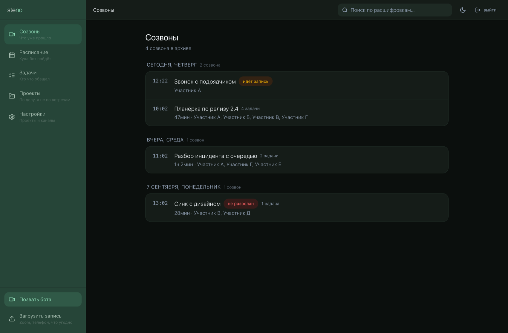

<!-- Русская версия. English: [README.md](README.md) -->

<div align="center">


# steno

**Созвоны, разобранные ботом, который знает твой код.**

[](https://github.com/sur1cat/steno/releases)
[](#установка)
[](#установка)
[](https://go.dev)
[](LICENSE)

[English](README.md) · **Русский**

[](#установка)
[](#команды)
[](#панель)
[](#сколько-это-ест)
[](https://github.com/sur1cat/steno/releases/latest)

<picture>
  <source media="(prefers-color-scheme: dark)" srcset="assets/intro-ru-dark.svg">
  
</picture>

</div>

Бот заходит в созвон, пишет разговор, расшифровывает и собирает follow-up:
решения, задачи и открытые вопросы, разложенные по проектам и живущие дольше
одной встречи. Один бинарник на Go — панель вшита в него, ставить на сервер
нечего, кроме файла. Записи и расшифровки остаются у тебя.

<div align="center">
<picture>
  <source media="(prefers-color-scheme: dark)" srcset="assets/term-start-ru-dark.svg">
  
</picture>
</div>


Всё это происходит без тебя. Или руками, по одному созвону:

```
steno join https://meet.google.com/abc-defg-hij   # один созвон, прямо сейчас
steno ui                                          # всё в терминале
```

## Как бот попадает в звонок

Четыре независимых источника, включается любой набор. Первый закрывает
запланированное, остальные три — неожиданное.

| Способ | Что делает человек |
|---|---|
| **Календарь** | ничего: бот сам читает календари команды и приходит за минуту до начала |
| **Приглашение на почту** | в идущем звонке жмёт «Добавить людей» и вводит `steno@company.com` |
| **Telegram** | кидает боту ссылку на созвон в чат |
| **HTTP** | слэш-команда в Slack, ярлык на телефоне, `curl` из скрипта |

Про **приглашение на почту** стоит сказать отдельно — это самый незаметный
способ. У бота свой Google-аккаунт (он всё равно нужен, чтобы заходить в Meet
без «постучаться»). Когда его добавляют в идущий звонок, Google шлёт на этот
адрес обычное письмо со ссылкой. steno видит письмо и приходит. Зовущему не
нужно знать про steno ничего: он приглашает его так же, как позвал бы коллегу.
Письма принимаются только от своего домена — иначе любой, кто узнал адрес
бота, смог бы записать чужой разговор его руками.

```
$ curl -X POST http://steno:8787/join \
       -H "Authorization: Bearer $STENO_HTTP_TOKEN" \
       -d '{"url":"https://meet.google.com/abc-defg-hij"}'
{"text":"Иду на https://meet.google.com/abc-defg-hij — follow-up придёт, когда созвон закончится."}
```

Общий секрет здесь не для галочки: кто его узнал, тот заводит бота в любой
созвон, то есть заставляет его записывать чужой разговор. Поэтому без секрета
этот вход не поднимается вовсе, а сам секрет живёт в `.env` — не в `steno.json`
и не в панели. Отказ называет, что именно не так: нет заголовка, не тот секрет
или ссылка не той площадки.

Один созвон — один бот, откуда бы про него ни узнали: встреча из календаря
лежит у всех участников, а ссылку в Telegram могут кинуть двое.

## Каналы независимы, комбинируются как угодно

Вход и выход разведены: каждый канал включается своим флагом, обязательных нет.

| Канал | Вход | Выход | Чем включается |
|---|---|:--:|---|
| Календарь | ✓ | | `calendar.enabled` |
| Почта бота | ✓ | | `gmail.enabled` |
| Telegram | ✓ | ✓ | `telegram.listen` / `telegram.enabled` |
| Slack | через HTTP | ✓ | `http.enabled` / `slack.enabled` |
| HTTP | ✓ | | `http.enabled` |
| Google Docs | | ✓ | `google_docs.enabled` |
| Панель | | ✓ | `panel.enabled` |

Отсюда любые сочетания: Telegram только принимает ссылки, а итоги уходят в
Docs. Или наоборот — источник только календарь, а Telegram только рассылает.
Или всё сразу. Выключить можно всё, кроме входа: follow-up всё равно ляжет в
базу, и его видно через `steno show`.

Одно правило поверх флагов: **кто попросил — тот получает ответ там, где
попросил**. Кинул боту ссылку в личку — follow-up придёт в личку, даже если
команда публикует его только в Google Docs. Позвал слэш-командой из `#релиз` —
вернётся в `#релиз`. Если это и есть настроенный канал, второй раз не шлём.

## Принеси своё

Два шва, и оба — это команда и страница договора. Ни для одного не нужно ни
строчки Go, ни пересборки, ни пулл-реквеста.

**Расшифровка** получает путь к аудио и печатает реплики. Три адаптера лежат в
[`adapters/`](adapters), четвёртый движок — это десяток строк на bash.

```json
"transcribe": { "cmd": ["./adapters/whisper-cpp.sh", "{{audio}}", "{{language}}"] }
```

**Публикация** получает созвон на stdin и печатает ссылку на опубликованное.
Discord, Mattermost, Notion, вебхук, почта, файл в папке, задача в Jira — по
небольшому скрипту на каждое.

```json
"publish": { "targets": [ { "cmd": ["./adapters/discord.sh"] } ] }
```

Что приезжает на stdin — и сырой разбор, и тот же follow-up уже свёрстанным:
адаптеру, который заводит задачи в трекере, нужны поля, а адаптеру, который
пишет в чат, нужен текст.

```json
{
  "meeting":    {"id": "…", "title": "…", "url": "…", "started_at": "…",
                 "duration_sec": 2520, "participants": ["…"], "projects": ["…"]},
  "followup":   {"title": "…", "tldr": ["…"], "action_items": [], "decisions": [],
                 "open_questions": [], "risks": [], "timeline": []},
  "text":       {"markdown": "…", "plain": "…", "html": "…"},
  "links":      {"google_doc": "…"},
  "transcript": "[00:01:12] Рустем: …"
}
```

Код 0 значит «опубликовано», любой другой — «нет», и stderr говорит почему: он
уходит в лог и остаётся рядом с созвоном. В stdout — ссылка, если она есть.

Списывать стоит с [`adapters/discord.sh`](adapters/discord.sh): вебхуку Discord
не нужно ни приложения, ни токена — только адрес.

## Что получается на выходе

Follow-up собран под то, как его читают: сначала три строки, дальше задачи с
владельцем и сроком, потом решения и открытые вопросы. Каждая задача несёт
дословную цитату и таймкод — чтобы можно было проверить, а не поверить.

Модели запрещено назначать задачу тому, кто её не брал: если по расшифровке
непонятно, владелец будет «не назначен».

## Как устроено

```
календарь       ┐
почта бота      ├──▶ бот в контейнере ──┐
telegram        │                       │
вызов по ссылке ┘                       ├──▶ audio.ogg + captions.jsonl
загрузка · заметка ─────────────────────┘              │
                                                       ▼
                      whisper или Groq ──▶ текст, имена от площадки
                                                       │
                                                       ▼
                                        расшифровка, сшитая по времени
                                                       │
          Claude · Codex · Ollama · свой скрипт ──▶ follow-up (JSON)
                                                       │
                                                       ▼
                               Google Docs · Slack · Telegram
                 панель, steno ui и строка меню — туда слать не нужно
```

Подробно, с обоснованием решений — [DESIGN.md](DESIGN.md).

## Установка

Один бинарник, и адаптеры расшифровки едут с ним: каждый способ ниже кладёт их
туда, где бинарник их ищет, и `steno setup` находит их без подсказок.

| | |
|---|---|
| [macOS, Linux](#homebrew) | `brew install sur1cat/tap/steno` |
| [Debian, Ubuntu](#debian-ubuntu) | `sudo apt install ./steno_<версия>_amd64.deb` — `.deb` лежит в [Releases](https://github.com/sur1cat/steno/releases/latest) |
| [Fedora, RHEL](#fedora-rhel) | `sudo dnf install ./steno-<версия>-1.x86_64.rpm` — `.rpm` там же |
| [Любой Linux или Mac](#архив) | `curl -L https://github.com/sur1cat/steno/releases/latest/download/steno_<версия>_<os>_<arch>.tar.gz \| tar xz` — `linux` или `darwin`, `amd64` или `arm64`; суммы в [checksums.txt](https://github.com/sur1cat/steno/releases/latest/download/checksums.txt) |
| [Из исходников](#собрать-самому) | `git clone https://github.com/sur1cat/steno && cd steno && make build` — нужны Go и Node; не `go install`, ниже сказано почему |
| Бот | Нужен запущенный Docker — бот заходит в созвон внутри контейнера, образ скачается перед первым созвоном; заранее — `docker pull ghcr.io/sur1cat/steno-bot` |

Дальше, каким бы путём ни пришёл:

```console
steno setup          # девять вопросов, каждый ответ проверяется
steno start          # работает фоном; остановить — steno stop
```

<div align="center">
<picture>
  <source media="(prefers-color-scheme: dark)" srcset="assets/term-install-dark.svg">
  
</picture>
</div>

`setup` сам заводит каталог (по умолчанию `~/steno`) и кладёт настройку туда —
готовить заранее ничего не нужно. Первым делом спрашивает язык: дальше мастер
говорит на нём, и он же попадает в конфиг. Следом — как ты будешь этим
пользоваться: один человек, небольшая команда или шесть созвонов разом, — и от
ответа ставит пределы и усилие модели. Секреты вводятся без отображения и
уходят в `.env` с правами 0600, в конфиг не попадают: конфиг кладут в
репозиторий, токены — нет.

Дальше проверить, и всё:

```
steno doctor         # скажет, чего не хватает и чем это лечится
```

### Homebrew

```console
brew install sur1cat/tap/steno
```

В формуле есть блок для Linux, так что там та же команда. ffmpeg приедет с
ней, адаптеры лягут в `$(brew --prefix)/share/steno/adapters`. На ARM-Linux у
Homebrew нет готовых сборок, и ffmpeg он стал бы собирать из исходников — там
лучше `.deb`, `.rpm` или архив.

### Debian, Ubuntu

```console
v=$(curl -fsSL https://api.github.com/repos/sur1cat/steno/releases/latest | sed -n 's/.*"tag_name": *"v\([^"]*\)".*/\1/p')
curl -fsSLO https://github.com/sur1cat/steno/releases/download/v$v/steno_${v}_amd64.deb
sudo apt install ./steno_${v}_amd64.deb
```

На ARM — `arm64`. `apt install ./файл.deb` притянет ffmpeg, `dpkg -i` оставил
бы его тебе. Бинарник ложится в `/usr/bin`, адаптеры — в
`/usr/share/steno/adapters`.

### Fedora, RHEL

```console
v=$(curl -fsSL https://api.github.com/repos/sur1cat/steno/releases/latest | sed -n 's/.*"tag_name": *"v\([^"]*\)".*/\1/p')
sudo dnf install https://github.com/sur1cat/steno/releases/download/v$v/steno-${v}-1.x86_64.rpm
```

На ARM — `aarch64`. Пакет просит `/usr/bin/ffmpeg`, а не пакет по имени:
подходит и `ffmpeg-free` из самой Fedora, и `ffmpeg` из RPM Fusion; в RHEL и
его клонах ffmpeg только из RPM Fusion.

### Архив

```console
v=$(curl -fsSL https://api.github.com/repos/sur1cat/steno/releases/latest | sed -n 's/.*"tag_name": *"v\([^"]*\)".*/\1/p')
curl -fsSLO https://github.com/sur1cat/steno/releases/download/v$v/steno_${v}_linux_amd64.tar.gz
curl -fsSL https://github.com/sur1cat/steno/releases/download/v$v/checksums.txt | grep linux_amd64 | sha256sum -c
tar xzf steno_${v}_linux_amd64.tar.gz
sudo install steno /usr/local/bin/
sudo mkdir -p /usr/local/share/steno && sudo cp -R adapters /usr/local/share/steno/
```

`linux` или `darwin`, `amd64` или `arm64`; на Mac вместо `sha256sum -c` —
`shasum -a 256 -c`. ffmpeg здесь ставишь сам: `apt install ffmpeg`,
`dnf install ffmpeg-free`, `brew install ffmpeg`.

Адаптерам необязательно лежать в `share`: steno первым делом смотрит рядом с
собственным бинарником, так что бинарник и `adapters/` могут просто лежать в
одном каталоге.

### Язык

По умолчанию английский — steno лежит на GitHub, и тот, кто открывает его
впервые, английского не выбирает, а ждёт. Русский — полноценный второй язык, а
не подмножество: CLI, терминальный интерфейс, панель и мастер говорят на нём
целиком.

Выбирается первым вопросом в `steno setup` и живёт в конфиге:

```json
{ "lang": "ru" }
```

Разово, не трогая конфиг:

```
STENO_LANG=ru steno ui
```

Выбор идёт дальше подписей: от него зависят язык follow-up
(`claude.output_language`), язык, которым Meet просят распознавать речь
(`bot.caption_language`), имя бота в списке участников и маркеры в календаре.

### Три способа пользоваться

**В терминале.** `steno ui` — созвоны, follow-up, задачи с фильтрами, проекты,
поиск и настройка каналов. Запущенный сервис для этого не нужен.

**В браузере.** `http://127.0.0.1:8422`, пока работает `steno start`.

**В строке меню** (macOS, собирается отдельно, в brew не входит):

```
cd bar && ./build.sh && open build/StenoBar.app
```

### Собрать самому

Если собирать самому:

```
git clone https://github.com/sur1cat/steno && cd steno
make build       # панель (нужен node) + бинарник steno
make test
```

Node нужен только на сборке: панель — приложение на React, и её бандл вшит в
бинарник. В проде остаётся один файл, ставится копированием.

Боту нужен Docker. Сам контейнер — Chromium под виртуальным дисплеем,
PulseAudio и ffmpeg — steno скачает перед первым созвоном той же версии, что и
он сам. Заранее или без доступа к сети:

```
docker pull ghcr.io/sur1cat/steno-bot        # готовый
make bot-image                               # или собрать свой
```

`go install` намеренно не предлагается. Собранный фронт — производное от
исходников, в репозитории его нет, и бинарник, поставленный так, поднимается
вообще без панели: с виду рабочая установка, пока её не откроешь.

Расшифровка — внешняя команда, а не встроенная библиотека. Готовые адаптеры:

| Адаптер | Что нужно |
|---|---|
| `adapters/whisper-cpp.sh` | whisper.cpp, ffmpeg, jq + модель |
| `adapters/faster-whisper.py` | `pip install faster-whisper` |

Модель — это отдельная загрузка, без неё адаптер не работает:

```
brew install whisper-cpp ffmpeg jq
mkdir -p ~/.cache/whisper

# распознавание: large-v3-q5_0, 1.03 ГБ
curl -L -o ~/.cache/whisper/ggml-large-v3-q5_0.bin \
  https://huggingface.co/ggerganov/whisper.cpp/resolve/main/ggml-large-v3-q5_0.bin

# VAD — 868 КБ, но ускоряет в 8 раз и убирает выдумки на тишине
curl -L -o ~/.cache/whisper/ggml-silero-v5.1.2.bin \
  https://huggingface.co/ggml-org/whisper-vad/resolve/main/ggml-silero-v5.1.2.bin
```

VAD стоит поставить обязательно, и вот почему. Запись созвона начинается с
тишины: бот заходит раньше людей. На тишине whisper всё равно гоняет полный
энкодер и вдобавок начинает выдумывать текст — на живой записи он выдал
«Редактор субтитров …» сорок раз подряд, затерев настоящую речь. VAD
эту тишину просто выбрасывает.

### Какую модель брать

**`large-v3-q5_0`.** Не `large-v3` и, что важнее, не `turbo`.

Пять моделей прогнаны на одной и той же записи созвона — Apple M3, 8 ядер,
Metal. Запись удачно попалась такая, где по буквам разбирают название продукта
(Plaud — диктофон для созвонов). Ровно на этом месте модели и расходятся:

| модель | на диске | Metal | пик RSS | «Plaud» распознан |
|---|---|---|---|---|
| `small` | 465 МБ | 32.9x | 805 МБ | нет, каша |
| `large-v3-turbo-q5_0` | 547 МБ | 25.0x | 803 МБ | **нет — «Cloud AI»** |
| `large-v3-turbo` | 1549 МБ | 16.5x | 1799 МБ | **нет — «Cloud» ×17** |
| **`large-v3-q5_0`** | **1031 МБ** | **13.7x** | 1927 МБ | **да** |
| `large-v3` | 2952 МБ | 10.2x | 3797 МБ | да |

Полная `large-v3` не даёт над `q5_0` ничего: расшифровки совпадают дословно, а
стоит она втрое больше места, вдвое больше памяти и в полтора раза больше
времени. Поэтому качать стоит `q5_0`.

**Почему turbo вычеркнута.** Она быстрее всех — и на этом заканчивается. На той
же записи она превратила `Plaud` в `Cloud AI`: не мусор, который видно глазом,
а связное и правдоподобное название **другой** вещи. Follow-up по такому тексту
уверенно напишет про облачную интеграцию, которой в разговоре не было. Плюс она
зацикливается, и воспроизводимо: `Cloud, Cloud, Cloud` семнадцать раз подряд на
Metal, `play` пятнадцать раз на CPU — 55 секунд самого содержательного куска
теряются целиком. Настройками не лечится: `-vmsd 10` не дал ничего, `-et 3.2`
(штатная защита от петель) сделал резко хуже. Причина в самой turbo — 4 слоя
декодера против 32 у large-v3.

Мелкие модели плохи иначе — заметно. Вот `small` на той же записи:

```
Или тени высохни на полчаса в них, как в тряпах состных назов.
Но ухуд, чёрт, у меня тут это перпекция, или что?
```

По такому тексту follow-up не сделать, но хотя бы видно, что делать его нельзя.
`steno doctor` отдельно предупреждает, если адаптер работает на мелкой модели.

### Сколько это ест

Числа выше — к длине файла, а в том файле речи было только 33%: остальное
пустое лобби, которое выбрасывает VAD. Для созвона, где говорят непрерывно,
делите втрое. Тогда на Apple M3:

| `large-v3-q5_0` | к реальному времени | час созвона |
|---|---|---|
| Metal | ~4.5x | ~13 минут |
| CPU | ~0.34x | **~3 часа** |

**Без GPU это неприменимо.** Даже квантованная large-v3 на восьми ядрах M3
расшифровывает час созвона дольше часа — очередь не рассосётся никогда. Либо
GPU, либо Groq, либо `source: "captions"`, где локально не считается ничего.

Потоки: по умолчанию адаптер берёт **производительные** ядра, а не все. На M3
(4P+4E) восемь потоков вышли медленнее четырёх — 47.6 с против 44.8 с — при
вдвое большем расходе CPU: энергоэффективные ядра тормозят барьер, на котором
ждут остальные. Для сервера это же значит: платить надо за быстрые ядра, а не
за их количество.

Больно не на одном созвоне, а когда несколько кончатся одновременно. Поэтому
расшифровки идут **по очереди** — `transcribe.max_concurrent`, по умолчанию
одна: аудио уже на диске, и очередь просто рассосётся. Плюс `threads`
(0 — все ядра) и `nice` (по умолчанию включён), чтобы расшифровка уступала
интерактивной работе.

GPU нужен **только для whisper**. Бот с записью — это одно ядро и ffmpeg на
32 кбит/с; Claude считает на своей стороне; панель и база — доли процента.

`steno doctor` прогоняет адаптер по-настоящему — на полусекунде тишины — и
показывает, чего не хватает. Найти файл скрипта мало: без модели он падает.

Селекторы Meet лежат в `selectors.json` и вшиты в бинарник. Чтобы чинить их
без пересборки, положи файл рядом и укажи путь в `bot.selectors` — он
прокинется и внутрь контейнера бота.

Любая команда, которая принимает путь к аудио и печатает
`{"segments":[{"start":1.2,"end":3.4,"text":"…"}]}`, тоже подойдёт — движок
меняется правкой `steno.json`, а не пересборкой.

## Первый запуск

Проверять всё сразу не надо — самое рискованное здесь одно: зайдёт ли бот в
звонок и попадут ли в субтитры имена. Это проверяется без whisper, без ключей
и вообще без настройки.

```
make build && make bot-image
./steno doctor -c steno.json
```

`doctor` показывает разом всё, чего не хватает, и что с этим делать — вместо
того чтобы ловить ошибки по одной, каждый раз заводя новый созвон.

Дальше — сама проверка. Заведи в Meet пустую встречу, возьми ссылку и:

```
./steno join --no-followup --captions https://meet.google.com/abc-defg-hij
```

Конфиг для этого не нужен: `--captions` берёт текст прямо из субтитров Meet,
`--no-followup` останавливается сразу после расшифровки. Ни whisper, ни ключа
Claude, ни Google-аккаунта бота.

Бот постучится как гость под именем «Steno · идёт запись» — впусти его,
поговори минуту вслух и выйди. Через минуту одиночества он уйдёт сам, покажет
расшифровку и остановится:

```
реплик: 23, из них с именем: 23

[00:00:12] Участник А: так, давайте начнём с релиза
[00:00:31] Участник Б: миграция готова процентов на восемьдесят, но я не успею
[00:00:58] Участник А: значит двигаем на пятницу

follow-up: steno process 2026-09-09-1130-a1b2 (нужен ключ Claude)
```

Три ступеньки, если что-то пойдёт не так, — каждая проверяет ровно одно:

| | что проверяет |
|---|---|
| `--record-only` | бот зашёл, звук пишется, субтитры ловятся |
| `--no-followup` | из субтитров или whisper получился текст с именами |
| без флагов | Claude собрал follow-up и он разошёлся по адресатам |

Пусто в субтитрах — они не включились: смотри `captionRegionLabels` в
`selectors.json`. Не нашлась кнопка входа — `joinButtonTexts` там же.

## Follow-up без установки whisper

`"transcribe": {"source": "captions"}` в конфиге делает режим `--captions`
постоянным. Качество ниже, чем у whisper — Meet теряет окончания и путает
термины, — но имена говорящих уже проставлены, ставить нечего, и весь конвейер
доходит до конца в первый же день. Останется только ключ Claude:

```
export ANTHROPIC_API_KEY=sk-ant-...
./steno process <id>      # follow-up по уже записанному
./steno show <id>
```

Для продакшена смени `source` на `command` и поставь whisper.

## Кто собирает follow-up

Вопрос задаётся при `steno setup`, в конфиге его закрепляет `brain.provider`.
Все четыре пути возвращают один и тот же JSON — дальше по течению никто не
знает, кто отвечал.

| | | |
|---|---|---|
| **Подписка Claude** | `claude -p`, штатный неинтерактивный режим Claude Code | ни ключа, ни второго счёта |
| **Ключ Anthropic** | нужен на сервере: работает без входа человеком | `ANTHROPIC_API_KEY` |
| **Совместимый с OpenAI** | OpenAI, Groq, OpenRouter, Together, DeepSeek — или Ollama, LM Studio, llama.cpp на этой же машине | заготовка или свой адрес |
| **Подписка ChatGPT** | `codex exec` — схема уходит файлом, поэтому соблюдается точнее всех | |

Модель на своей машине не стоит ничего и никуда ничего не отправляет: вместе с
локальным whisper это установка, из которой наружу не уходит вообще ничего.

Если не подходит ни один путь — внутренний эндпоинт, своя обёртка, чужой
протокол, — `brain.provider = "command"` зовёт скрипт: один объект JSON приходит
в stdin, один уходит из stdout. Договор расписан словами в `adapters/ollama.sh`.

`steno doctor` говорит, что из этого нашлось и какая модель вышла в итоге.

## Настройка

```
cp steno.example.json steno.json
```

Секреты в конфиг не кладутся: там лежат имена переменных окружения.

```
export ANTHROPIC_API_KEY=...
export SLACK_BOT_TOKEN=xoxb-...
export TELEGRAM_BOT_TOKEN=...
```

**Google Docs.** Нужен service-account с domain-wide delegation и поле
`subject` — почта того, от чьего имени создаются документы. `folder_id` —
папка Drive, куда всё падает.

Область по умолчанию — полный `drive`, и это не перестраховка: со
`drive.file` приложение видит только созданные им самим файлы, поэтому
положить документ в заранее созданную руками папку с ним нельзя. Если папку
создаёт сам steno, область можно сузить в `scopes`.

**Slack.** Права бота: `chat:write`, `users:read` (сопоставить имена с
профилями) и `im:write` (личные сообщения тем, на ком задача). Для слэш-команды
нужен ещё `SLACK_SIGNING_SECRET`: без подписи поле `channel_id` в запросе —
обычные данные формы, которые может прислать кто угодно, а именно по нему
follow-up уходит в канал. Без секрета слэш-команды просто не принимаются.

**Telegram.** Создать бота у @BotFather, добавить в чат, взять `chat_id`.
С `listen: true` тот же бот принимает ссылки на созвоны — только из чатов,
перечисленных в `allowed_chats`.

**Календарь и почта.** Тот же service-account, но области другие:
`calendar.readonly` и `gmail.readonly`. Каждый календарь читается от имени его
владельца — отдельного OAuth на каждого сотрудника не нужно, достаточно один
раз выдать domain-wide delegation в админке Workspace.

**Аккаунт бота в Meet.** Гостя хост должен впускать вручную. Если завести
отдельный Google-аккаунт в том же Workspace, залогиниться им в Chromium один
раз и отдать профиль боту, он будет заходить сам:

```
export STENO_CHROME_PROFILE=/var/lib/steno/chrome-profile
```

## Команды

```
steno setup              настроить всё: спросит по одному и проверит
steno ui                 всё в терминале: созвоны, задачи, проекты, поиск
steno start              запустить фоном; steno stop — остановить
steno status             работает ли, с какого времени, где лог
steno autostart on|off   запускать при входе в систему
steno serve              то же, что start, но не отпуская терминал

steno join <meet-url>    зайти в созвон, записать, расшифровать, разослать
steno process [id]       расшифровать и разослать записанный созвон
steno publish [id]       разослать готовый follow-up ещё раз
steno show [id]          показать follow-up (--json — сырой)
steno transcript [id]    показать расшифровку
steno list               последние созвоны
steno rm <id>            забыть созвон целиком: запись, расшифровку, follow-up
                         и задачи, которые из него вышли (--yes — не спрашивать)

steno projects [имя]         что открыто по проектам
steno projects add <имя>     завести: --repo, --path, --url, --about, --alias
steno projects rm <имя>      убрать из реестра
steno context [проект]       собрать справку по коду и сайтам

steno doctor             проверить, чего не хватает для запуска
steno demo               панель на демо-данных: без настройки и созвона
steno mcp                MCP-сервер для Claude Code, Claude Desktop, Cursor:
                         claude mcp add steno -- steno mcp
steno cost [дней]        сколько потрачено на follow-up
steno version            версия и какой образ бота ей соответствует
steno prune              удалить старые записи по срокам из конфига
steno bot --url <u>      сам бот; запускается внутри контейнера
```

Где стоит `[id]`, его можно не писать — возьмётся последний созвон, и steno
скажет какой.

Флаг `--local` у `join` запускает бота без docker — если Chromium, ffmpeg и
PulseAudio уже есть на машине.

Каждый бот получает имя `steno-<id>` и метку `steno=1`. Если что-то пошло не
так и контейнеры остались висеть:

```
docker ps -f label=steno
docker kill $(docker ps -q -f label=steno)
```

На Linux контейнер пишет в примонтированную папку от uid 1000 (PulseAudio
отказывается работать под root). Если хостовая папка принадлежит другому
пользователю: `chown -R 1000:1000 data/`.

## Панель

`panel.enabled` поднимает веб-панель: список созвонов, полнотекстовый поиск по
всем расшифровкам и follow-up сразу, расписание на неделю вперёд, страница «кто
что должен», живое состояние проектов и плеер с кликабельными таймкодами.



Поиск понимает начало слова — «миграц» находит и «миграции», и «миграцией».
Каждая находка ведёт не просто в созвон, а в тот момент записи, где это
сказали. Куски индекса режутся по смене говорящего: иначе найденное
приписывалось бы соседу, а в архиве созвонов это худшая из возможных ошибок.

Пароль общий на команду (`STENO_PANEL_PASSWORD`): заводить учётку каждому ради
архива — работа, которую никто не сделает. Cookie подписана ключом из пароля,
поэтому смена пароля разлогинивает всех и отдельного хранилища сессий нет.
За TLS поставь `"secure": true`.

Посмотреть панель на правдоподобных данных, не дожидаясь первого созвона:
`steno demo` — временная база, четыре созвона с задачами и решениями,
расписание на два дня вперёд, пароль `demo`. По Ctrl+C всё исчезает.

### Расписание и «позвать бота»

Календарный источник смотрит на две минуты вперёд: ему достаточно понять, что
созвон вот-вот начнётся. Человеку этого мало — он хочет видеть заранее, куда
бот пойдёт сегодня, а куда нет.

Вкладка «Расписание» показывает встречи на неделю вперёд и **почему** бот не
пойдёт на конкретную: «нет ссылки на Meet», «участников 1, нужно хотя бы 2»,
«стоит метка „не записывать“». Молчаливое «бот не пришёл» разбирать
невозможно, названная причина чинится за минуту. Кнопки «не ходить» и «пойти»
переопределяют решение — заранее, а не выгоняя бота из уже идущего звонка на
глазах у всех. Решение живёт отдельно от расписания и переживает его
пересборку.

Кнопка «Позвать бота» есть в шапке и на расписании: собрались в две минуты,
встречу никто не заводил — ссылка в поле, и бот идёт. Ответ различает три
исхода: пошёл, уже иду туда, все слоты записи заняты. Последнее — не «ок»:
человеку надо знать, что его созвон не пишется.

### Сборка панели

Панель — приложение на React (Vite, TypeScript, Tailwind). Собранный бандл
вшивается в бинарник через `go:embed`, поэтому деплой остаётся одним файлом:
node нужен на сборке и только на ней, в проде ни node_modules, ни второго
процесса нет.

```
make build       # соберёт панель, потом бинарник
make panel       # только фронт
make panel-dev   # vite на 5273, /api проксируется в запущенный steno serve
```

`make build` не падает без node, если `internal/panel/web/dist` уже собран, —
но собрать бинарник с пустой панелью молча не даст: «панель не открывается»
потом разбирают часами. Сам бандл в git не хранится: это производное от
исходников, а конфликты в минифицированном JS никому не нужны.

Тёмная тема идёт за системной настройкой — отдельного переключателя нет, и не
должно быть: панель открывают между делом, и лишний выбор здесь ни к чему.

### Каналы настраиваются в панели

Календарь, почта бота, Telegram, Slack, Google Docs и HTTP включаются и
настраиваются на вкладке «Настройки», а не правкой JSON. Причина та же, что у
проектов: «завести бота в наш Slack» — работа того, кто в этом Slack сидит.
Настройки лежат в базе, `steno.json` остаётся начальным значением и переезжает
в базу при первом запуске; дальше главнее база.

Токены при этом в базу не попадают: в настройке канала лежит имя переменной
окружения, значение читается из неё. Панель показывает только «задан» или
«пусто» — класть токен Slack туда же, где расшифровки всех разговоров, плохой
размен.

Адресаты (Telegram, Slack, Google Docs) перечитываются перед каждой рассылкой:
включил Slack в панели — следующий созвон уедет туда без перезапуска.
Источники (календарь, почта, приём в Telegram, HTTP) слушают сеть с самого
старта, и их переключение подхватывается при следующем запуске сервиса —
дёргать их на ходу значило бы ронять идущие записи.

## Спросить у ассистента

`steno mcp` — MCP-сервер поверх той же базы: ассистент, который знает твой
код, теперь знает и что решила команда — с секундой, на которой это сказали.
Сервис для этого запускать не нужно.

<div align="center">
<picture>
  <source media="(prefers-color-scheme: dark)" srcset="assets/term-mcp-ru-dark.svg">
  
</picture>
</div>

Это протокол, а не привязка к одному вендору — подключается любой клиент MCP:

```console
claude mcp add steno -- steno mcp     # Claude Code
codex  mcp add steno -- steno mcp     # Codex CLI
```

Cursor, Claude Desktop, Zed и остальные берут то же самое в JSON —
`{"mcpServers": {"steno": {"command": "steno", "args": ["mcp"]}}}`. Локальная
модель тоже работает: Ollama отдаёт модель, а со steno разговаривает клиент
перед ней — Goose, LM Studio, oterm. Семь инструментов, из них один пишет
(`close_item`), остальные только читают: `list_meetings`, `get_followup`,
`get_transcript`, `search`, `projects`, `open_items`.

## Проекты

На одном созвоне обсуждают три-четыре проекта сразу, и плоский follow-up через
месяц превращается в кучу, из которой не вытащить, что к чему относилось.

Проекты заводятся в панели, на вкладке «Настройки»: название, как называют
вслух, описание и источники — всё в одной модалке, без ухода со списка. Правит
их тот, кто в проекте разбирается, — без JSON и перезапуска сервиса. Проекты из `steno.json` переезжают в базу при
первом запуске, дальше главнее база.

Псевдонимы нужны, потому что вслух проект называют не так, как он записан.

Дальше у каждого решения, задачи и вопроса появляется проект. Схлопывание
псевдонимов делает не модель, а этот список: «биллинг» становится «Платежами»
детерминированно, а не как сегодня решит Claude. Что не относится ни к одному —
попадает в «не определён», и это лучше, чем приписать чужому.

### Справка о проекте

К проекту прикладываются источники — строками в модалке проекта, у каждой
выпадашка с видом и поле значения:

| Вид | Что это |
|---|---|
| GitHub-репозиторий | склонируем поверхностно, на один коммит |
| Локальный каталог | папка на этой же машине |
| Сайт | одна страница: описание продукта обычно и есть его словарь |
| Просто текст | когда объяснить проще словами, чем ссылкой |

Раньше это была одна textarea, куда писали `вид значение` построчно, и
«непонятный вид магия» человек узнавал только после сохранения. Строка с
выпадашкой ошибиться в виде не даёт вовсе.

`steno context` (или кнопка в модалке проекта) собирает из них справку. Репозиторий
читается не целиком — это десятки тысяч токенов на проект, — а по тому, из чего
видно суть и словарь: README, манифесты, состав каталогов и темы последних
шестидесяти коммитов. Последнее оказалось самым полезным: именно в коммитах
лежат слова, которыми команда говорит о проекте вслух. Репозиторий по ссылке
клонируется поверхностно, на один коммит.

Справка кладётся в базу с отпечатком материала: не менялся — не пересобираем и
не платим второй раз. На созвоне она уходит в промпт, и «поправим вебхуки в
биллинге» раскладывается по Платежам, потому что модель видела эти слова в коде.

Справка учится по репозиторию и сайту, но пока не по самим созвонам — это
следующий шаг.

### Репозиторий подтягивается раз в сутки

Разово склонированный репозиторий устаревает за неделю, и бот начинает
рассуждать о проекте по прошлогоднему коду. Поэтому раз в сутки `steno serve`
подтягивает изменения и разбирает то, что появилось с прошлой сверки.

Локальный каталог (`path`) при этом не трогается: это рабочая копия человека, и
делать в ней `pull` — влезать в чужую работу. Он читается как есть.

Справка пересобирается не на каждый коммит, а когда накопилось
`rebuild_after_commits` или прошло `rebuild_after`: от правки опечатки она не
меняется, а стоит денег.

### Задачи закрываются коммитами

Задача, сделанная тихо и не упомянутая ни на одном созвоне, висела бы открытой
вечно. Поэтому раз в сутки новые коммиты и открытые задачи проекта уходят в
Claude вместе, и он говорит, что чем сделано.

Закрывается только уверенное. «Начал», «черновик», «WIP» — это не выполнение, и
такое уходит в сводку отдельным разделом, без закрытия: задача, закрытая
ошибочно, исчезает из списка, и её никто не сделает. Выдуманные идентификаторы
и хеши отбрасываются — сверяются с теми, что были отданы.

Сводка приходит раз в сутки в Telegram или Slack:

```
Платежи — за сутки 12 коммитов

Закрыто коммитами:
  • закончить миграцию схемы — Участник Б
    коммит a1b2c3d4 «миграция схемы подписок»
    коммит делает ровно то, что описано в задаче

Похоже, сделано — но не закрывал:
  • проверить откат на копии прода — Участник В
    коммит e5f6a7b8 «начал проверку отката»
    работа начата, но не выглядит законченной

Ещё открыто: 3 задачи
```

Любую задачу можно закрыть и вернуть в работу кнопкой на странице проекта —
в том числе если коммит закрыл её ошибочно.

### Состояние проекта живёт дольше созвона

Задачи, решения и вопросы копятся отдельно от встреч. Перед каждым новым
созвоном модель получает список того, что уже висит открытым — с короткими
идентификаторами вроде `T-ab95`, — и говорит, что из этого закрылось. Поэтому
одна и та же задача не заводится заново каждую неделю, а документ по проекту
обновляется по ходу дел.

```
$ steno projects
Платежи — открыто 3
  Задачи
    T-ab95  закончить миграцию схемы — Участник Б (до 2026-09-11)
  Открытые вопросы
    Q-4092  кто дежурит в выходные после выката — Участник А
```

То же самое в панели: вкладка «Проекты» и страница проекта с разделами
«Задачи», «Открытые вопросы», «Решения» и «Закрыто».

С `"google_docs": {"project_docs": true}` на каждый проект заводится документ,
который **обновляется на месте** — ссылка не меняется. Тридцать документов по
одному на созвон никому не нужны; нужен один, всегда актуальный.

## Смешанная речь

Субтитры Meet распознают **одним** языком на сессию: переведённые субтитры
переводят с этого одного, а не распознают несколько. Поэтому на созвоне, где
переходят с русского на английский, режим `--captions` не годится — вторая
половина превратится в кашу.

Для таких созвонов нужен whisper (`transcribe.source: "command"`) и пустой
`transcribe.language` — тогда язык определяется автоматически. Субтитры при
этом всё равно нужны: имена говорящих берутся только из них, и на них смена
языка не влияет.

## Что живёт долго, а что нет

`retention.recordings` (по умолчанию 30 дней) сносит аудио. Расшифровка,
follow-up и ссылки на публикации остаются в базе навсегда: возвращаются обычно
за ними, а переслушивать запись почти никогда не нужно. `steno serve` убирает
раз в сутки сам, отдельный cron не нужен.

Остановка сервиса не обрывает идущие записи: `steno serve` ждёт их до
`bot.shutdown_grace` (15 минут). Если не дождался — выходит, но аудио остаётся
на диске, и созвон доводится до конца командой `steno process <id>`.

## Согласие на запись

Бот входит под именем из конфига, по умолчанию «Steno · идёт запись», чтобы
в списке участников было видно, что созвон пишется. Любой участник может
выгнать бота — запись корректно закроется, а follow-up соберётся по тому, что
успели записать. Строчку про запись стоит положить в описание встречи: в ряде
юрисдикций нужно согласие всех сторон, а не только организатора.

## Что работает, а что пока нет

Честный список. Всё, что не помечено отдельно, проверено на живых созвонах.

**Работает.** Заход в Google Meet и запись; расшифровка whisper локально или
через Groq; follow-up с задачами, решениями, открытыми вопросами и рисками;
разбор по проектам; справка о проекте, собранная по репозиторию; Telegram на
вход и на выход; панель; `steno ui`; фоновый режим с автозапуском; приложение
в строке меню.

**Работает, но с оговоркой.** Имена говорящих берутся из субтитров площадки.
Если в Meet стоит не тот язык, на котором говорят, он выдаёт почти пустоту —
несколько слов за несколько минут, — и имён не хватает. steno тогда добирает их
с плитки активного говорящего и из списка участников, а в лог пишет, сколько на
самом деле снялось. Выставить язык кликами надёжно нельзя: Google убрал
отдельную кнопку и нынешнюю разметку нигде не документирует. Поставь его один
раз руками в аккаунте бота: ⋮ → Настройки → Субтитры → язык встречи. Meet
запоминает.

**Сделано, но живьём не проверено.** Jitsi Meet — разбор страницы взят из их же
сквозных тестов, но бот в настоящий звонок Jitsi ещё не заходил. Календарь,
почта бота и Slack как источники. Публикация в Google Docs. Суточная сверка
коммитов с задачами.

**Намеренно не сделано.** Microsoft Teams: политика собрания умеет ставить
анонимным участникам CAPTCHA — именно чтобы не пускать таких ботов, и заранее не
видно, включена ли она. Zoom: вход по ссылке зависит от настройки, которую
часть организаций выключает, а всё остальное требует их SDK. Заявленная, но
неработающая площадка хуже отсутствующей: узнаешь об этом на созвоне.

**Ещё нет.** Slack как вход без публичного адреса (нужен Socket Mode).
