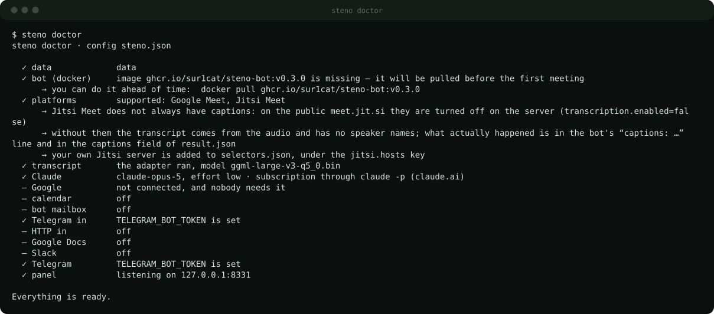
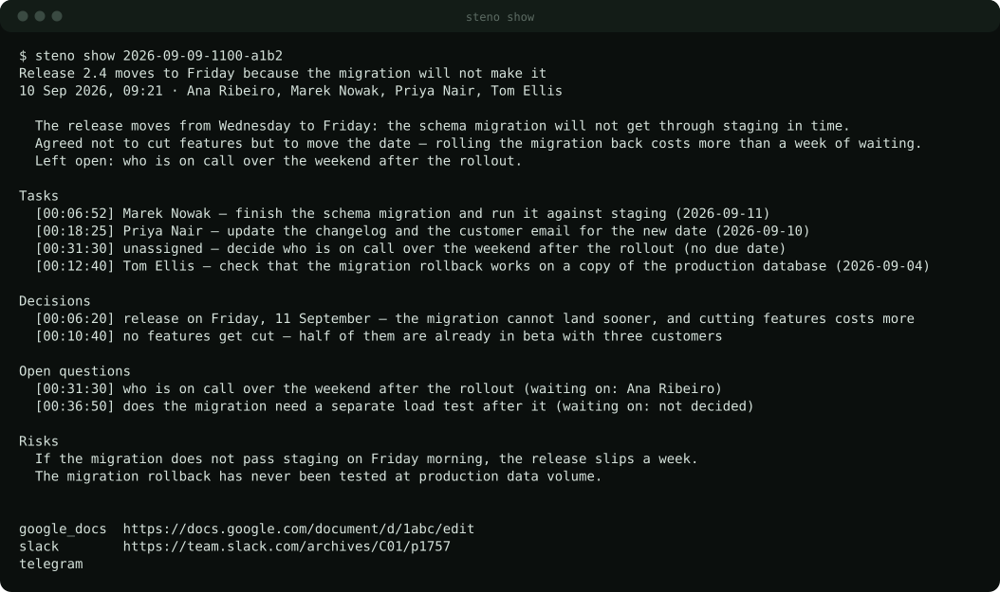
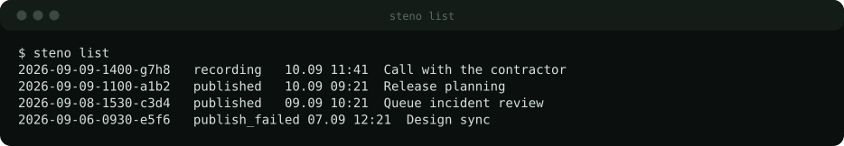
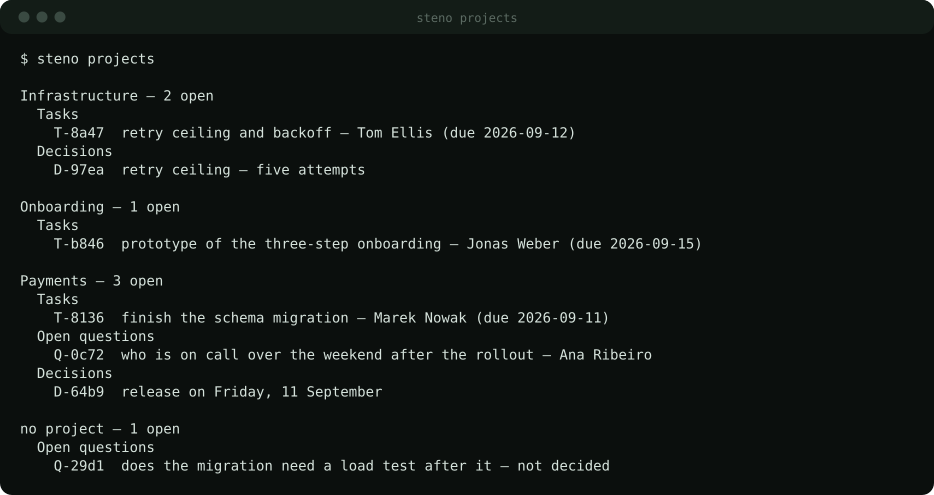
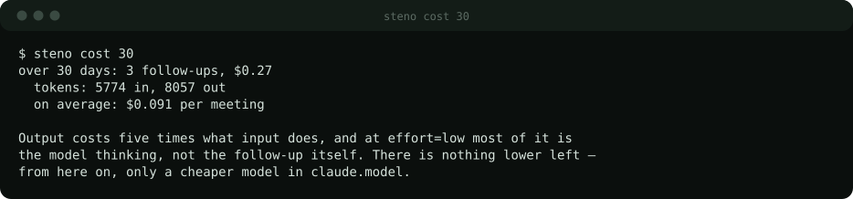

[← README](../README.md) · **Commands** · [Install](install.md) · [Cost](cost.md) · [How it works](how-it-works.md)

# Commands

Every command reads the same database the panel does, so almost none of them
needs the service running. `-c <path>` points at another `steno.json`.

## Run it

| | |
|---|---|
| `steno setup` | set it all up: one question at a time, each answer checked |
| `steno start` | run in the background — listen to the sources, go to meetings |
| `steno stop` | stop it, letting recordings in flight finish |
| `steno serve` | the same as `start`, without letting go of the terminal |
| `steno status` | is it running, since when, where the log is |
| `steno autostart on\|off` | start it when you log in |
| `steno doctor` | check every piece and print the fix under each problem |
| `steno demo` | the panel on demo data, no setup: a temporary base, four meetings, gone on Ctrl+C. `--addr`, `--no-open` |
| `steno version` | the version, and the bot image that matches it |



## Record a meeting

| | |
|---|---|
| `steno join <meet-url>` | join, record, transcribe, send the follow-up |
| &nbsp;&nbsp;`--record-only` | record only |
| &nbsp;&nbsp;`--no-followup` | record and transcribe, no model, no follow-up |
| &nbsp;&nbsp;`--captions` | text from the platform's captions instead of whisper |
| `steno note` | dictate into the microphone — Enter stops it, then the same pipeline |
| &nbsp;&nbsp;`--devices` · `--device N` | list the microphones · pick one |
| &nbsp;&nbsp;`--title "…"` · `--max 30m` | name it yourself · recording ceiling |
| `steno process [id]` | transcribe a recorded meeting and send it out — no id, the last one |
| `steno publish [id]` | send a finished follow-up again |

## Read what came out

| | |
|---|---|
| `steno ui` | the whole product, full screen in the terminal |
| `steno list` | recent meetings with the status each got stuck at |
| `steno show [id]` | the follow-up as text, with timecodes and where it went |
| `steno transcript [id]` | the transcript itself |
| `steno projects [name]` | what is open per project |
| `steno cost [days]` | measured tokens and what they cost |
| `steno mcp` | an MCP server over stdio — a model asks the same database, see [below](#ask-a-model) |



Summary, tasks with owners and dates, decisions with reasons, questions with who
they wait on, risks. Each carries the second it was said; the footer says where
it went.





The state that outlives the meeting. Short ids, so the CLI and the panel talk
about the same thing.



## Ask a model

`steno mcp` is an MCP server over stdio on the same database: the assistant
connects to it and answers *"what did we decide about the migration?"* or
*"what is open on payments?"* itself. No service needs to run, and `-c` picks
the config the same way it does everywhere else.

It is a protocol, not a vendor — any MCP client works:

```console
claude mcp add steno -- steno mcp        # Claude Code
codex  mcp add steno -- steno mcp        # Codex CLI (lands in ~/.codex/config.toml)
```

Cursor, Claude Desktop, Zed, Windsurf and the rest take the same thing in their
JSON: `{"mcpServers": {"steno": {"command": "steno", "args": ["mcp"]}}}` —
Claude Desktop does not read your shell's PATH, so give it the full path from
`which steno`. A local model works the same way: Ollama only serves the model,
so pick a client that speaks MCP and point it at Ollama — Goose, LM Studio,
oterm, ollmcp — and add steno there.

| | |
|---|---|
| `list_meetings` | recent meetings: id, title, when, how long, who, status, task count; `project` narrows it |
| `get_followup` | one meeting's write-up: tldr, decisions, tasks with owners and dates, questions, risks |
| `get_transcript` | the lines with their second and speaker; `from_sec`/`to_sec` window, 200 lines per call |
| `search` | full text over transcripts and follow-ups: meeting, second, passage |
| `projects` · `open_items` | what is open per project — tasks, questions, decisions, with owner and origin |
| `list_specs` · `get_spec` | the specs written for tasks, and one in full with the agent's log — read only: writing and running them stays with a person |
| `close_item` | the one tool that writes: closes an item as done or dropped, with a reason |

## Projects — how it learns your vocabulary

| | |
|---|---|
| `steno projects add <name>` | add a project; with no flags it asks |
| &nbsp;&nbsp;`--repo <url>` | repository (may be repeated) |
| &nbsp;&nbsp;`--path <dir>` | directory with the code on this machine |
| &nbsp;&nbsp;`--url <addr>` | site or document |
| &nbsp;&nbsp;`--about "…"` | one line saying what this project is |
| &nbsp;&nbsp;`--alias a,b` | what it is called out loud |
| &nbsp;&nbsp;`--people a,b` | people's names as they are said out loud |
| &nbsp;&nbsp;`--word a,b` | the project's services and abbreviations |
| `steno projects rm <name>` | remove it from the registry; its tasks stay |
| `steno context [name]` | build the primers from the code and the sites |

## A task becomes a branch

| | |
|---|---|
| `steno spec` | every open task, and whether it has a spec: written, declined, running, done |
| `steno spec <task-id>` | write the spec for one task from the project's repository — `T-3f2a` from `steno projects` |
| &nbsp;&nbsp;`--all` · `--project <name>` | every open task of a project; tasks that are not about code are declined for the price of one short call |
| `steno spec show <spec-id>` | the spec in full, and the agent's log once it ran |
| `steno spec run <spec-id>` | hand it to Claude Code or Codex: a worktree of its own, a branch, a commit — never a push |
| `steno agent` | what is on, who executes, where the branches go |
| `steno agent on\|off` | allow or forbid running specs on this machine — the one switch, read live by the panel and the menu bar |
| `steno agent auto on\|off` | write specs on its own after every write-up (reading the code and one model call per task) |

A spec must name what is still missing; one that names no open question, no
place in the code that exists, or no step of work cannot be run — from the
terminal, the panel, the menu bar or `steno ui` alike. Running is never
triggered by anything that comes from outside: not Telegram, not mail, not the
HTTP endpoint. Same in the panel: the task in its project has a **Spec** button,
the spec page has **run the agent**; `steno ui` has `t` on a task and `a` on
the spec; the menu bar has the same two buttons and both switches under ⋯.

## Clean up

| | |
|---|---|
| `steno rm <id>` | forget a meeting whole — recording, transcript, follow-up. Asks first |
| &nbsp;&nbsp;`--yes` | do not ask, for scripts |
| `steno prune` | delete old recordings by the retention in the config |
